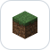
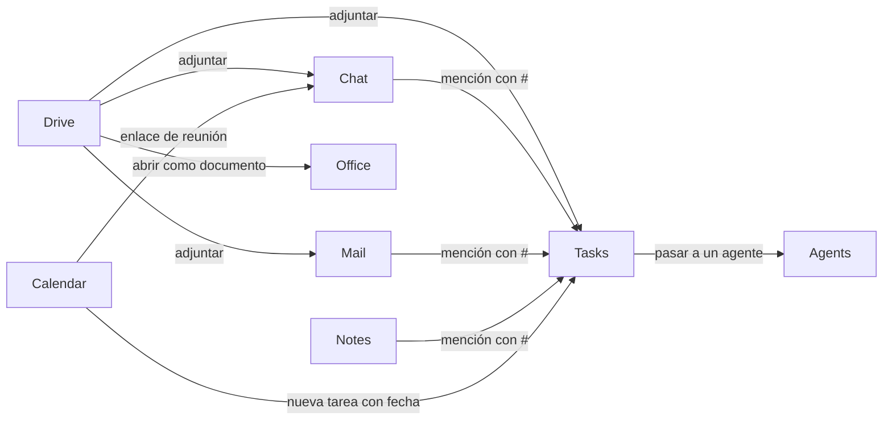
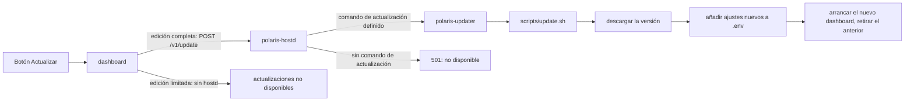
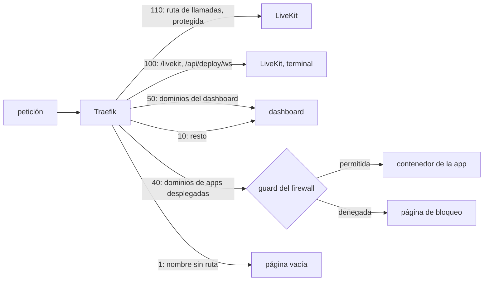
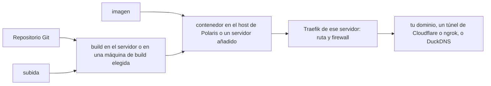
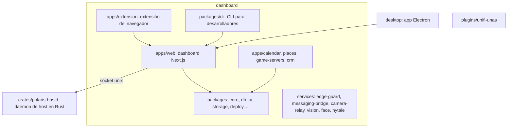

<div align="center">
  <h1>Polaris</h1>
  <h3>Tu home lab, un solo panel de control.</h3>
  <a href="README.md">English</a>
  <span>&nbsp;&nbsp;•&nbsp;&nbsp;</span>
  <a href="#instalar">Instalar</a>
  <span>&nbsp;&nbsp;•&nbsp;&nbsp;</span>
  <a href="#todo-se-conecta">Integraciones</a>
  <span>&nbsp;&nbsp;•&nbsp;&nbsp;</span>
  <a href="#licencia">Licencia</a>
  <hr />
</div>

Polaris es un espacio de trabajo autoalojado para todo lo que gestionas tú mismo:
tus archivos, tus servidores, las apps que despliegas en ellos, el trabajo que
planificas a su alrededor y las personas con las que lo haces. Una instalación, un
inicio de sesión y una interfaz.

Después de instalarlo no hace falta una terminal: las actualizaciones, las funciones
nuevas y las reparaciones se hacen desde la interfaz.

La guía completa (qué incluye cada app, requisitos, uso y desarrollo) está en el
[README en inglés](README.md).

## Instalar

Un comando. Levanta todo: dashboard, base de datos, proxy inverso y el daemon de
host, y genera sus secretos:

```bash
# macOS / Linux
curl -fsSL https://raw.githubusercontent.com/FJRG2007/polaris/main/dashboard/scripts/install.sh | sh

# Windows (PowerShell)
irm https://raw.githubusercontent.com/FJRG2007/polaris/main/dashboard/scripts/install.ps1 | iex
```

Linux es el host recomendado. Para instalarlo a mano con Docker Compose, sigue los
pasos de [Install](README.md#install).

## Dónde funciona

La interfaz está en español e inglés, y cada cuenta elige la suya.

| Cliente                                                                                 | Estado                                                                             |
| --------------------------------------------------------------------------------------- | ---------------------------------------------------------------------------------- |
| App web, instalable desde el navegador                                                  | Disponible                                                                         |
| Extensión para Chrome y Firefox: rellena formularios de inicio de sesión desde tu vault | Disponible ([versiones](https://github.com/FJRG2007/polaris/releases?q=extension)) |
| Servidor MCP para Claude, ChatGPT, Cursor, VS Code y otros clientes de IA               | Disponible ([configuración](docs/connecting-ai-assistants.md))                     |
| CLI para desarrolladores (`plr`): despliegues, logs, reinicios                          | Próximamente: en el repositorio, sin versión publicada                             |
| App de escritorio para Windows, macOS y Linux                                           | Próximamente: en el repositorio, sin versión publicada                             |
| Apps para iOS y Android                                                                 | Próximamente                                                                       |

## Todo se conecta

Los servicios con los que Polaris ya habla. Cada uno se activa desde la interfaz.

|                                                                                                                                                                                                                                                                                                                                                                                                                                                                                                                                                                                                                                                                                                                                                                                                                                                                                                                                                                                       |                                                                                                                                                                         |
| ------------------------------------------------------------------------------------------------------------------------------------------------------------------------------------------------------------------------------------------------------------------------------------------------------------------------------------------------------------------------------------------------------------------------------------------------------------------------------------------------------------------------------------------------------------------------------------------------------------------------------------------------------------------------------------------------------------------------------------------------------------------------------------------------------------------------------------------------------------------------------------------------------------------------------------------------------------------------------------- | ----------------------------------------------------------------------------------------------------------------------------------------------------------------------- |
|                                                                                                                                                                                                                                                                                                                                                                                                                                                                                                                                                                                                                                                                                                                                                                                                                                                                                            | **Google**: inicio de sesión, Calendar y Tasks sincronizados en los dos sentidos, Gmail como buzón, Google Drive como almacenamiento, Docs y Sheets importados a Office |
|                                                                                                                                                                                                                                                                                                                                                                                                                                                                                                                                                                                                                                                                                                                                                                                                                                                                                   | **Microsoft 365**: calendario de Outlook sincronizado, correo de Outlook, OneDrive como almacenamiento                                                                  |
|                                                                                                                                                                                                                                                                                                                                                                                                                                                                                                                                                                                                                                                                                                                                                                         | **GitHub**: inicio de sesión, desplegar repositorios, ejecutar Actions en tus propios runners, leer pull requests e issues                                              |
|                                                                                                                                                                                                                                                                                                                                                                                                                                                                                                                                                                                                                                                                                                                                                                                                       | **Linear y Jira**: issues reflejadas en Tasks, con el estado devuelto                                                                                                   |
|                                                                                                                                                                                                                                                                                                                                                                                                                                                                                                                                                                                                                                                                                                                                                                                        | **CalDAV**: iCloud, Nextcloud, Fastmail, Yahoo o cualquier servidor CalDAV, además de feeds ICS                                                                         |
|                                                                                                                                                                                                                                                                                                                                                                                                                                                                                                                                                                                               | **Inbox**: conversaciones de Telegram, WhatsApp, Discord y Slack en un solo sitio                                                                                       |
|                                                                                                                                                                                                                                                                                                                                                                                                                                                                                                                                                                                                                                                                                 | **Almacenamiento y hosts**: Dropbox, UniFi UNAS, S3, SFTP, SMB y NFS en Drive; el motor Docker de cada servidor que añades                                              |
|                                                                                                                                                                                                                                                                                                                                                                                                                                                                                                                                                                                                                                                                                                            | **Desplegar fuera**: proyectos de Vercel, Railway y AWS (ECS, Amplify) junto a los tuyos                                                                                |
|                                                                                                                                                                                                                                                                                                                                                                                                                                                                                                                                                                                                                                                                                          | **Red**: registros DNS y túneles con Cloudflare, túneles de ngrok, nombres de DuckDNS                                                                                   |
|                                                                                        | **Modelos**: tus propias claves para estos y más de 50 proveedores                                                                                                      |
|                                                                                                                                                                                                                                                                                                                                                                                                                                                                                                                                                                             | **Agentes de código**: Claude Code, Codex, Gemini CLI, Copilot CLI, Cursor CLI, OpenCode y 9 más en sesiones en vivo; los clientes MCP se conectan como tú              |
|           | **Places**: enchufes, luces, cerraduras y climatización de estas marcas; cámaras Tapo, VIGI, Reolink, Hikvision, Dahua, Amcrest o cualquier cámara ONVIF o RTSP         |
|                                                                                                                                                                                                                                                                                                                                                                                                                                                                                                                                                                                      | **Servidores de juegos**: los jugadores vinculan sus cuentas para que el servidor los reconozca                                                                         |
|                                                                                                                                                                                                                                                                                                                                                                                                                                                                                                                                                                                                                                                                                                         | **Chat**: escuchar juntos en Spotify, GIFs de Tenor y GIPHY, filtro de ruido de Krisp en llamadas                                                                       |
|                                                                                                                                                                                                                                                                                                                                                                                                                                                                                                                                                                                                                                                                                                                                                                      | **Seguridad**: archivos subidos analizados por VirusTotal, direcciones maliciosas bloqueadas con Criminal IP o Dymo                                                     |
|                                                                                                                                                                                                                                                                                                                                                                                                                                                                                                                                                                                                                                                                                                                                                                               | **Vault**: las apps y extensiones de Bitwarden apuntan a él; importa de Bitwarden, KeePass o cualquier CSV                                                              |
|                                                                                                                                                                                                                                                                                                                                                                                                                                                                                                                                                                                                                                                                                                                                                                                                                                                                                      | **Notas**: un vault de Obsidian, o cualquier carpeta de Markdown, importado con sus enlaces                                                                             |
|                                                                                                                                                                                                                                                                                                                                                                                                                                                                                                    | **Bases de datos**: desplegadas o externas, para explorar, consultar y respaldar                                                                                        |

Mail acepta además cualquier cuenta IMAP e importa archivos `.mbox` y `.eml`.

## Las apps se enlazan entre sí

Lo que se crea en una app se alcanza desde las demás sin copiarlo.

- **Menciónalo.** Escribe `#` en un mensaje de chat, un correo, una tarea o una nota para enlazar una tarea, un doc o una nota. Un enlace pegado a una tarea, evento, canal o mensaje se convierte en una tarjeta con su estado actual.
- **Adjunta desde Drive.** Chat, Mail, Tasks y Office toman un archivo directamente de Drive, sin descargarlo y volver a subirlo.
- **Planifícalo en Calendar.** Crea una tarea que vence en un hueco, o da a un evento un enlace de reunión de Polaris.
- **Pásaselo a un agente.** Una tarea va a un agente de código desde su panel; el agente la lee y la mueve con el servidor MCP de Polaris.
- **Entérate en Chat.** Las alertas de cámaras y dispositivos de Places llegan como mensajes.



## Incluido en cada app que despliegas

Funciona con cualquier servicio que Polaris despliegue, sin SDK, agente ni cambios en el código de la app: se ejecuta en el edge o en el host.

|                                                                                                                                                                                                                                                    | En lugar de                                         | Polaris                                                                                                                                                |
| -------------------------------------------------------------------------------------------------------------------------------------------------------------------------------------------------------------------------------------------------- | --------------------------------------------------- | ------------------------------------------------------------------------------------------------------------------------------------------------------ |
|   | Google Analytics, Plausible                         | **Analytics** leída del log de accesos del edge, sin etiqueta script                                                                                   |
|                                                                                                                                             | Cloudflare WAF y Access                             | **Firewall** delante de cada ruta: reglas por país y red, defensa contra bots, detección de inyecciones, baneos y un muro de inicio de sesión opcional |
|                                                                                                                           | Beekeeper Studio y otros clientes de bases de datos | **Bases de datos**: explorar y consultar Postgres, MySQL, MariaDB, MongoDB y Redis                                                                     |
|                                                                                                                                          | Uptime Kuma y otros monitores de disponibilidad     | **Watch**: cada dominio comprobado, y aviso si una caída se mantiene                                                                                   |
|                                                                                                                                                      | Datadog y otros agentes de métricas                 | **Métricas** de cada contenedor y servidor, leídas por SSH y Docker                                                                                    |
|                                                                                                                                     | Certbot                                             | **HTTPS**: certificados de Let's Encrypt emitidos y renovados para cada dominio público                                                                |

 El seguimiento de errores es la excepción: **Telemetry** recibe eventos del SDK de Sentry que tu app ya usa, así que el único cambio es el DSN.

## Cómo funciona

### Actualizar

El botón Actualizar de Ajustes es como se actualiza un Polaris instalado. La edición limitada no tiene daemon de host, así que allí el botón indica que las actualizaciones no están disponibles.



### Una petición a través del edge

Cada router tiene una prioridad explícita, de mayor a menor. Las rutas con reglas de firewall pasan por el guard antes de llegar a la app.



### Desplegar una app



### Estructura del repositorio



## Licencia

Polaris se distribuye bajo la [GNU AGPL-3.0](LICENSE) con los términos adicionales
de [NOTICE.md](NOTICE.md). Para usarlo fuera de esos términos, por ejemplo en un
producto de código cerrado, pide una licencia comercial (ver
[NOTICE.md](NOTICE.md)).
