<div align="center">
  <h1>Polaris</h1>
  <h3>Your home lab, one control plane.</h3>
  
  
  
  <br />
  <br />
  <a href="#if-you-already-pay-for-these">Why</a>
  <span>&nbsp;&nbsp;•&nbsp;&nbsp;</span>
  <a href="#install">Install</a>
  <span>&nbsp;&nbsp;•&nbsp;&nbsp;</span>
  <a href="#whats-in-it">What's in it</a>
  <span>&nbsp;&nbsp;•&nbsp;&nbsp;</span>
  <a href="#everything-connects">Integrations</a>
  <span>&nbsp;&nbsp;•&nbsp;&nbsp;</span>
  <a href="#usage">Usage</a>
  <span>&nbsp;&nbsp;•&nbsp;&nbsp;</span>
  <a href="docs/developers/README.md">Developers</a>
  <span>&nbsp;&nbsp;•&nbsp;&nbsp;</span>
  <a href="README.es.md">Español</a>
  <hr />
</div>

Polaris is a self-hosted workspace for everything you run yourself: your files,
your servers, the apps you deploy on them, the work you plan around them, and the
people you do it with. One install, one login, one dark interface with an app
switcher in the top-left corner.

It replaces the pile that usually grows around a home lab or a small team - a
file browser, a deployment tool, a task board, a chat client, a password manager,
an uptime monitor, an analytics script - with one control plane where those
things already know about each other. A deploy can be discussed in a channel, a
task can carry the file, and everybody in it has one account.

Polaris runs in Docker and reaches out from there: native mounts, the host's own
Docker engine, and the machines you enrol over SSH are all managed from the one
container. After the install, nothing needs a terminal - updates, new features
and repairs all happen from the interface.

## A look inside

Every picture below is the real interface, drawn from its own components with
made-up data, and follows your light or dark setting. Most open a page on
their area with more pictures and everything it does. Phone-sized versions sit
beside them in [docs/assets/media](docs/assets/media).

### Talk

<table>
  <tr>
    <td width="50%" valign="top">
      <a href="docs/features/chat.md">
      <picture>
        <source media="(prefers-color-scheme: light)" srcset="docs/assets/media/chat-light-en-desktop.webp">
        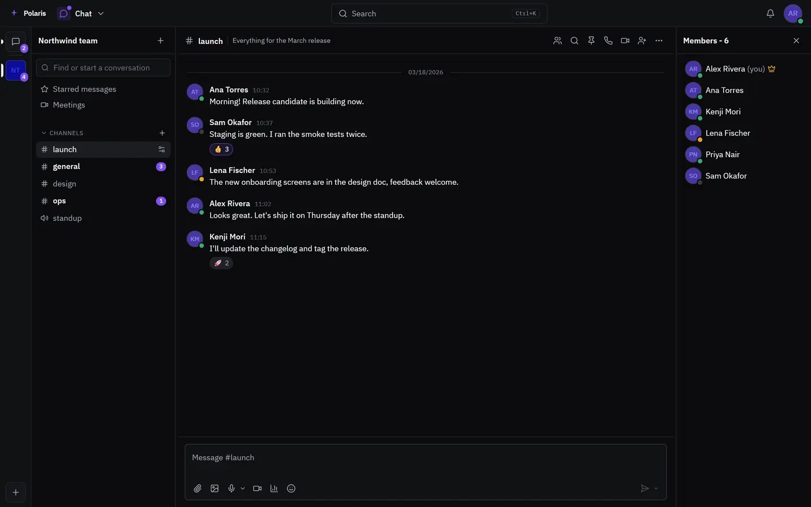
      </picture>
      </a>
      <br><sub><a href="docs/features/chat.md"><b>Chat</b></a>: spaces, channels, threads and direct messages</sub>
    </td>
    <td width="50%" valign="top">
      <a href="docs/features/calls.md">
      <picture>
        <source media="(prefers-color-scheme: light)" srcset="docs/assets/media/in-call-light-en-desktop.webp">
        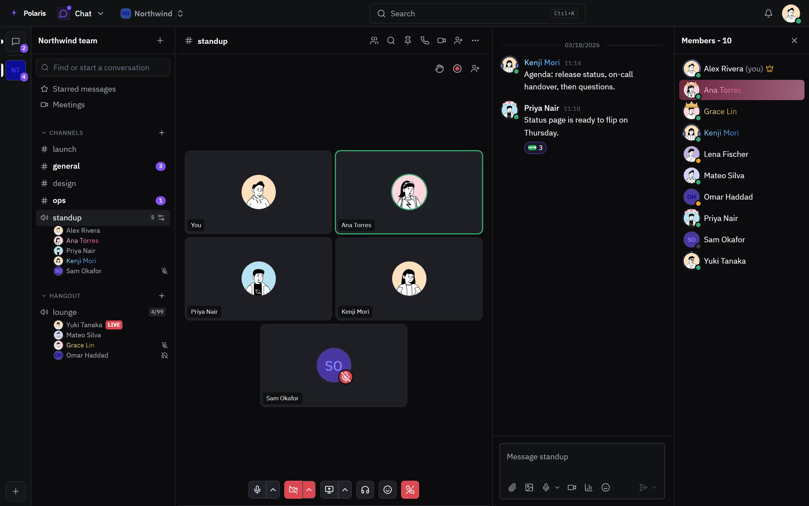
      </picture>
      </a>
      <br><sub><a href="docs/features/calls.md"><b>Calls</b></a>: voice channels, meetings and calls in any chat</sub>
    </td>
  </tr>
</table>

### Work

<table>
  <tr>
    <td width="50%" valign="top">
      <a href="docs/features/tasks.md">
      <picture>
        <source media="(prefers-color-scheme: light)" srcset="docs/assets/media/tasks-light-en-desktop.webp">
        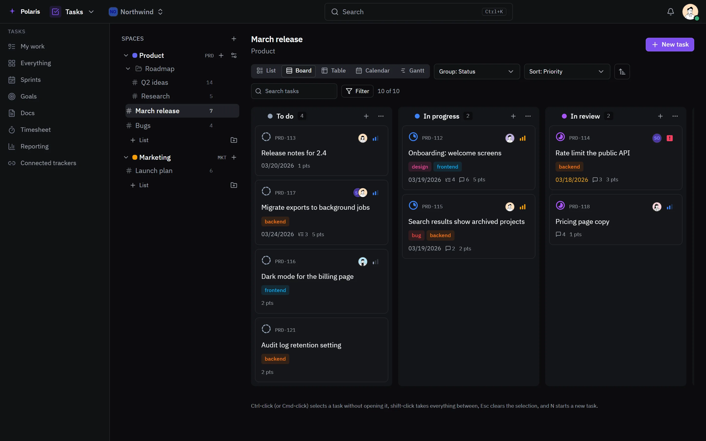
      </picture>
      </a>
      <br><sub><a href="docs/features/tasks.md"><b>Tasks</b></a>: lists, boards, sprints and goals</sub>
    </td>
    <td width="50%" valign="top">
      <a href="docs/features/calendar.md">
      <picture>
        <source media="(prefers-color-scheme: light)" srcset="docs/assets/media/calendar-light-en-desktop.webp">
        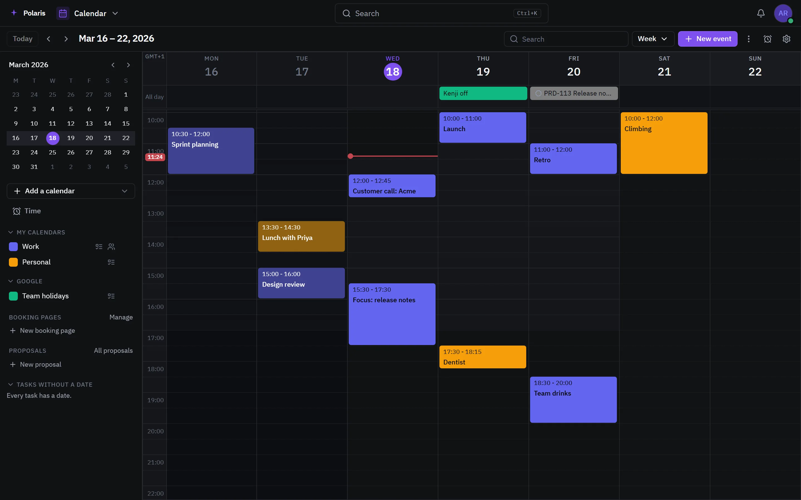
      </picture>
      </a>
      <br><sub><a href="docs/features/calendar.md"><b>Calendar</b></a>: every calendar you have, synced both ways</sub>
    </td>
  </tr>
  <tr>
    <td width="50%" valign="top">
      <a href="docs/features/mail.md">
      <picture>
        <source media="(prefers-color-scheme: light)" srcset="docs/assets/media/mail-light-en-desktop.webp">
        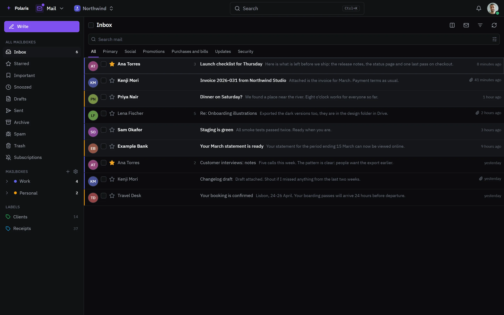
      </picture>
      </a>
      <br><sub><a href="docs/features/mail.md"><b>Mail</b></a>: every mailbox in one inbox</sub>
    </td>
    <td width="50%" valign="top">
      <a href="docs/features/office.md">
      <picture>
        <source media="(prefers-color-scheme: light)" srcset="docs/assets/media/office-light-en-desktop.webp">
        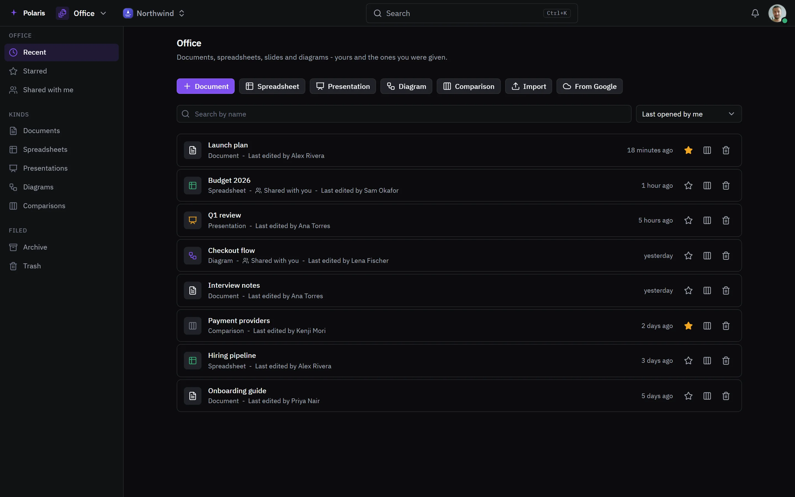
      </picture>
      </a>
      <br><sub><a href="docs/features/office.md"><b>Office</b></a>: documents, sheets, slides and diagrams</sub>
    </td>
  </tr>
</table>

### Files and secrets

<table>
  <tr>
    <td width="50%" valign="top">
      <a href="docs/features/drive.md">
      <picture>
        <source media="(prefers-color-scheme: light)" srcset="docs/assets/media/drive-light-en-desktop.webp">
        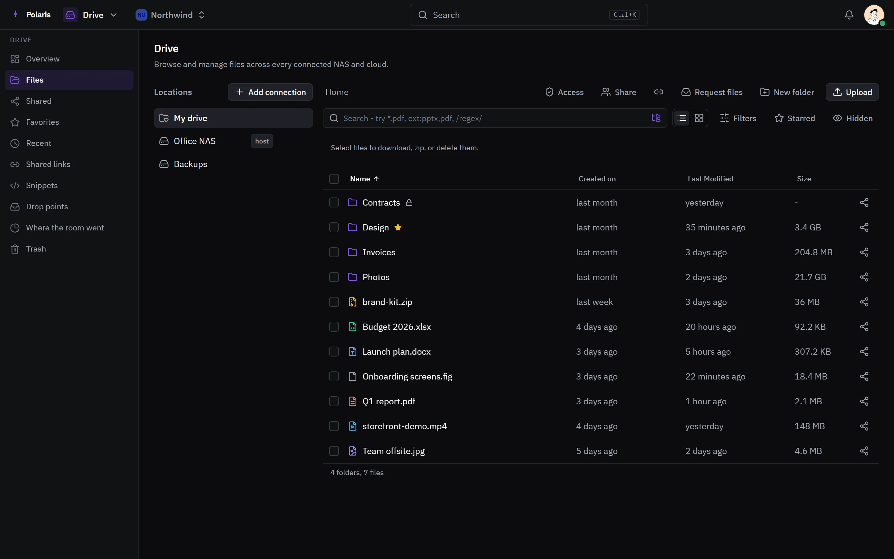
      </picture>
      </a>
      <br><sub><a href="docs/features/drive.md"><b>Drive</b></a>: your drive and every storage you own</sub>
    </td>
    <td width="50%" valign="top">
      <a href="docs/features/vault.md">
      <picture>
        <source media="(prefers-color-scheme: light)" srcset="docs/assets/media/vault-light-en-desktop.webp">
        
      </picture>
      </a>
      <br><sub><a href="docs/features/vault.md"><b>Vault</b></a>: passwords and one-time codes, Bitwarden compatible</sub>
    </td>
  </tr>
</table>

### Running things

<table>
  <tr>
    <td width="50%" valign="top">
      <a href="docs/features/deploy.md">
      <picture>
        <source media="(prefers-color-scheme: light)" srcset="docs/assets/media/deploy-project-light-en-desktop.webp">
        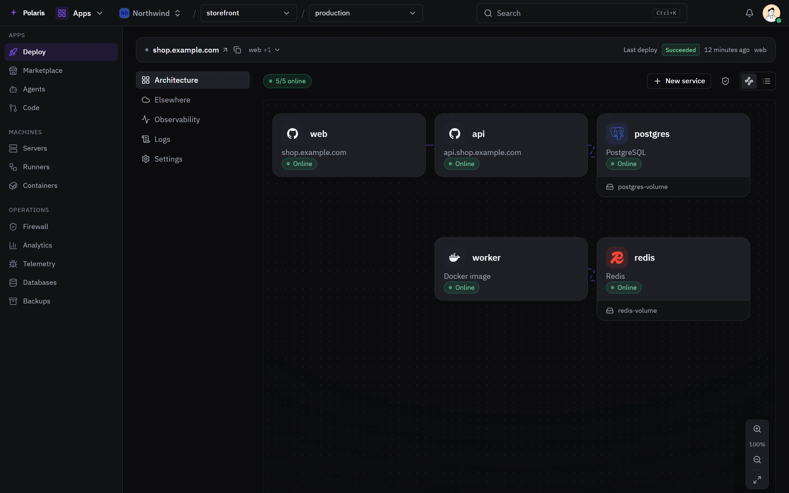
      </picture>
      </a>
      <br><sub><a href="docs/features/deploy.md"><b>Deploy</b></a>: apps, databases and domains on your machines</sub>
    </td>
    <td width="50%" valign="top">
      <a href="docs/features/marketplace.md">
      <picture>
        <source media="(prefers-color-scheme: light)" srcset="docs/assets/media/marketplace-light-en-desktop.webp">
        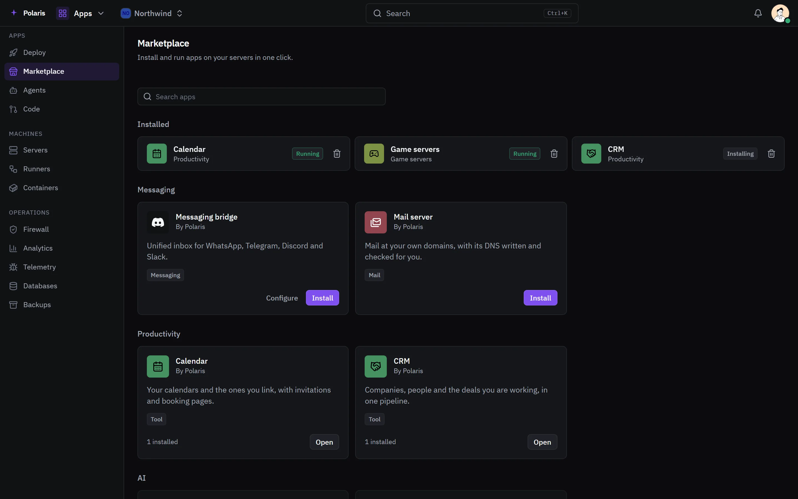
      </picture>
      </a>
      <br><sub><a href="docs/features/marketplace.md"><b>Marketplace</b></a>: apps installed with one press</sub>
    </td>
  </tr>
  <tr>
    <td width="50%" valign="top">
      <picture>
        <source media="(prefers-color-scheme: light)" srcset="docs/assets/media/games-light-en-desktop.webp">
        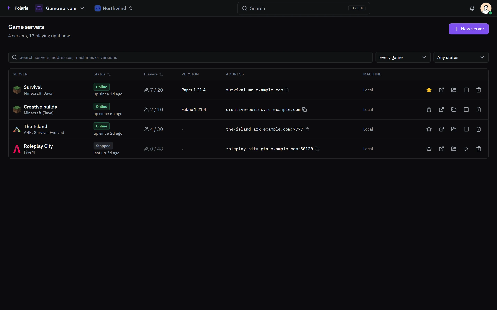
      </picture>
      <br><sub><b>Game servers</b>: Minecraft, ARK and FiveM on your own machines</sub>
    </td>
  </tr>
</table>

### Getting around

<table>
  <tr>
    <td width="50%" valign="top">
      <a href="docs/features/launcher.md">
      <picture>
        <source media="(prefers-color-scheme: light)" srcset="docs/assets/media/launcher-light-en-desktop.webp">
        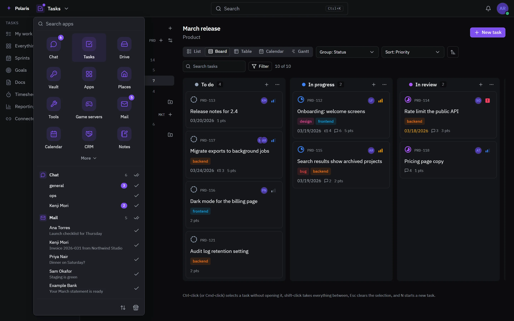
      </picture>
      </a>
      <br><sub><a href="docs/features/launcher.md"><b>App launcher</b></a>: every app, and what is waiting in each</sub>
    </td>
    <td width="50%" valign="top">
      <a href="docs/features/settings.md">
      <picture>
        <source media="(prefers-color-scheme: light)" srcset="docs/assets/media/settings-light-en-desktop.webp">
        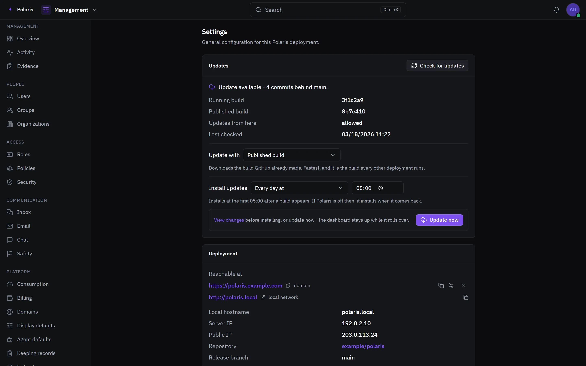
      </picture>
      </a>
      <br><sub><a href="docs/features/settings.md"><b>Settings</b></a>: the deployment's, and your own account's</sub>
    </td>
  </tr>
</table>
## If you already pay for these

The fastest way to say what Polaris is: it is the tools you are already using,
on hardware you already own, sharing one account and one interface.

| What you use today                 | What Polaris runs instead                                                                                                                                                           |
| ---------------------------------- | ----------------------------------------------------------------------------------------------------------------------------------------------------------------------------------- |
| Railway, Render, Fly               | Deploy from a repository or an image - onto their servers or onto your own machines                                                                                                 |
| Discord, Slack, WhatsApp, Telegram | One chat: channels and servers, direct messages, calls, meetings, voice notes, screen clips                                                                                         |
| GitHub Actions                     | The same workflows on your own runners, so a private repository costs no minutes                                                                                                    |
| CodeRabbit                         | Reviews and coding agents that run here, on your own model keys                                                                                                                     |
| Pterodactyl and a pile of scripts  | Game servers - Minecraft, ARK and FiveM - with worlds, mods, resources, players and schedules                                                                                       |
| ClickUp, Jira, Linear              | Spaces, lists, boards, sprints, goals, docs and time tracking - or connect your existing Linear or Jira and keep its issues mirrored in, with status pushed back                    |
| Google Calendar, Proton Calendar   | Day to year views, sharing and public links, two-way sync with Google, Microsoft and any CalDAV server, reminders, invitations and booking pages other people can reserve a slot on |
| Home Assistant, a camera app       | Places: cameras with live views, detections, clips and alerts, plus switches, plugs, lights, locks, air conditioners and purifiers from a dozen brands, with automations            |
| Your NAS vendor's web UI           | One file browser across every NAS you own, with sharing and drop points                                                                                                             |
| Bitwarden, 1Password               | A vault your existing Bitwarden apps can point at, encrypted in the browser                                                                                                         |
| Cloudflare's dashboard             | A firewall of your own: rules, country and network blocks, bot defences, bans                                                                                                       |
| A backup tool and a database GUI   | Scheduled backups with restore, and Postgres, MySQL, MariaDB, MongoDB and Redis                                                                                                     |
| Google Analytics, Plausible        | Cookieless analytics for the sites you host                                                                                                                                         |

None of it is a fork of any of them. It is the same idea, built once, with the
half those products cannot give you: it is yours, it is on your hardware, and
every part of it knows about the others.

## Install

One command. It brings up the whole stack - dashboard, database, reverse proxy
and the privileged host daemon - generates its secrets, and needs no flags:

```bash
# macOS / Linux
curl -fsSL https://raw.githubusercontent.com/FJRG2007/polaris/main/dashboard/scripts/install.sh | sh

# Windows (PowerShell)
irm https://raw.githubusercontent.com/FJRG2007/polaris/main/dashboard/scripts/install.ps1 | iex
```

Linux is the recommended host - Ubuntu Server is what Polaris is run against.
Windows works, but Docker there runs inside WSL and the host Polaris manages is
that virtual machine rather than the machine itself; see
[Requirements](#requirements).

Prefer to do it by hand? Clone the repo and run Compose directly:

```bash
git clone https://github.com/FJRG2007/polaris.git
cd polaris/dashboard/docker
cp .env.example .env                  # then replace every REPLACE_ME value in it
docker network create polaris-proxy   # compose expects both to exist already
docker network create polaris-hub
docker compose --profile full up -d
```

Then open `https://127.0.0.1/oauth/setup?token=` followed by the
`POLARIS_SETUP_TOKEN` you put in `.env`, and create the administrator. The
certificate is self-signed until a domain points here, so the browser warns once.

Updating is a button in Settings. There is a script behind it for anybody who
would rather drive it themselves.

## What's in it

Every app is switched on per account and per role, so somebody invited to help
with one thing does not get the rest.

**Files and secrets**

- **Drive** - a private drive for every account from the moment they open it, plus
  a shelf for every organization, reached by everybody on its roster; browsing,
  uploading, downloading and sharing across every NAS you own: local disks,
  SFTP, S3-compatible, SMB/NFS, UniFi UNAS, Google Drive, OneDrive and Dropbox
  (WebDAV, Synology, QNAP and TrueNAS are coming). Streaming transfers, so multi-gigabyte files never
  buffer. Send a file or folder to a person or an organization, a copy by
  default or the file itself on a move, kept with the sender until accepted;
  share a file or folder with a person or group, with a role, a note and
  an expiry; public links with passwords and expiry; drop points for people who
  have no account; viewers and editors for documents, spreadsheets, PDFs and
  media; and a grid that shows the picture of an image or a document's first
  page instead of a generic icon.
- **Vault** - a password manager that speaks the Bitwarden client protocol, so
  the apps and extensions you already use point at your own instance. Everything
  is encrypted in the browser; the server never sees a master password.

**Running things**

- **Deploy** - deploy an app from a Git repository or an image, with databases,
  volumes, environment variables, logs, a terminal, a file browser and a domain.
  Public access through your own domain, a Cloudflare tunnel or DuckDNS.
- **Servers** - enrol a machine over SSH with one generated command, then use its
  terminal, files, metrics and Docker engine from here.
- **Containers** and **Backups** - what is running on every host, and scheduled
  backups of it with restore.
- **Marketplace** - one-press installs for the things people actually self-host,
  including **game servers** (Minecraft, ARK and FiveM, with worlds, mods,
  resources, players, schedules, crash detection and Minecraft challenges -
  daily, weekly, a season pass, bingo and community goals).
- **Runners** - GitHub Actions compatible CI on your own machines, with per-repo
  policy and budgets.
- **Agents** - coding agents that work in a repository: headless runs that open
  pull requests and answer reviews with your own model keys, and live sessions
  that run the vendor's own CLI (Claude Code, Codex and others) in a real
  terminal you can watch and steer from anywhere. A task can be handed straight
  to one from its panel, and the agent reads and moves it back through
  Polaris's own MCP server.
- **Code** - the pull requests and issues you have open on GitHub, read as you.
- **Databases** - Postgres, MySQL, MariaDB, MongoDB and Redis: browse, query and
  back up what you deployed, or connect to one elsewhere - directly or through an
  SSH tunnel, via a registered server or a login typed into the connection.

**Work and people**

- **Tasks** - spaces, lists, boards, sprints, goals, docs, custom fields,
  automations, forms and time tracking.
- **Calendar** - day, week, month and year views, sharing and public links,
  two-way sync with Google, Microsoft 365 and any CalDAV server or ICS feed,
  reminders, invitations, free/busy, meeting rooms and booking pages other
  people can reserve a slot on, plus a Time area with alarms, timers, focus
  cycles, a stopwatch and a world clock.
- **Chat** - servers and channels, direct messages and groups, with calls,
  meetings, screen sharing, voice messages, screen clips recorded in the browser,
  and messages written now and sent at an hour that suits.
- **Notes** - somewhere to write things down, nested the way a notebook is.
- **Inbox** - conversations that arrive from outside, across every channel you
  connect.
- **Organizations** - teams, rosters and per-organization roles, so a group of
  people can own work together.

**Keeping an eye on it**

- **Watch** - alarms on app health, spikes and outages, with webhooks, and a
  record of every time the deployment itself lost its connection, with uptime
  and a 90-day heatmap.
- **Analytics** - cookieless web analytics for the sites you host.
- **Firewall** - a rule per protection: allow and deny lists, country and network
  rules, bot and scraper defences, injection scanning, and automatic bans.
- **Domain security** - every domain Polaris knows, audited for spoofable mail
  (SPF, DKIM, DMARC, MTA-STS), DNS exposure (DNSSEC, CAA, open zone transfers,
  dangling records), registration (expiry, transfer lock) and web hardening
  (TLS, HSTS, security headers), with one-click fixes where Polaris manages the
  domain and a notice the moment a daily re-check finds it worse than before.
- **Places** - the places you own, their cameras and their smart devices: live
  views, clips, events, detections and alerts that arrive as messages; switches,
  plugs, lights, locks, air conditioners and air purifiers from Tuya, TP-Link,
  Shelly, Hue, IKEA, Gree, Philips (Air+, HomeID and Dynalite lighting), Home
  Assistant and SwitchBot; automations
  that react to any of them; plus a notice the moment
  a camera itself stops answering.

**The account itself**

Passwords, passkeys, two-factor, trusted devices, QR sign-in from another device,
sessions, API keys, access rules, privacy settings, notification preferences, and
a record of where your account stands. Claude, ChatGPT, Cursor, VS Code and any
other MCP client can connect as you, with your own consent screen deciding what
each one may touch - see
[`docs/connecting-ai-assistants.md`](docs/connecting-ai-assistants.md).

What is built versus in progress is tracked in
[`dashboard/ROADMAP.md`](dashboard/ROADMAP.md).

## Where it runs

The interface is in English and Spanish ([en español](README.es.md)), and each account picks its own.

| Client                                                                        | Status                                                                           |
| ----------------------------------------------------------------------------- | -------------------------------------------------------------------------------- |
| Web app, installable from the browser                                         | Available                                                                        |
| Browser extension for Chrome and Firefox: fills sign-in forms from your vault | Available ([releases](https://github.com/FJRG2007/polaris/releases?q=extension)) |
| MCP server for Claude, ChatGPT, Cursor, VS Code and other AI clients          | Available ([setup](docs/connecting-ai-assistants.md))                            |
| Developer CLI (`plr`): deploy, logs, restarts                                 | Coming: in the repo, not released yet                                            |
| Desktop app for Windows, macOS and Linux                                      | Coming: in the repo, not released yet                                            |
| iOS and Android apps                                                          | Coming                                                                           |

## Everything connects

The services Polaris already talks to. Each one is switched on from the interface.

|                                                                                                                                                                                                                                                                                                                                                                                                                                                                                                                                                                                                                                                                                                                                                                                                                                                                                                                                                                                       |                                                                                                                                                          |
| ------------------------------------------------------------------------------------------------------------------------------------------------------------------------------------------------------------------------------------------------------------------------------------------------------------------------------------------------------------------------------------------------------------------------------------------------------------------------------------------------------------------------------------------------------------------------------------------------------------------------------------------------------------------------------------------------------------------------------------------------------------------------------------------------------------------------------------------------------------------------------------------------------------------------------------------------------------------------------------- | -------------------------------------------------------------------------------------------------------------------------------------------------------- |
|                                                                                                                                                                                                                                                                                                                                                                                                                                                                                                                                                                                                                                                                                                                                                                                                                                                                                            | **Google**: sign in, two-way Calendar and Tasks sync, Gmail as a mailbox, Google Drive as storage, Docs and Sheets imported into Office                  |
|                                                                                                                                                                                                                                                                                                                                                                                                                                                                                                                                                                                                                                                                                                                                                                                                                                                                                   | **Microsoft 365**: Outlook calendar sync, Outlook mail, OneDrive as storage                                                                              |
|                                                                                                                                                                                                                                                                                                                                                                                                                                                                                                                                                                                                                                                                                                                                                                         | **GitHub**: sign in, deploy repositories, run Actions on your own runners, read pull requests and issues                                                 |
|                                                                                                                                                                                                                                                                                                                                                                                                                                                                                                                                                                                                                                                                                                                                                                                                       | **Linear and Jira**: issues mirrored into Tasks, status pushed back                                                                                      |
|                                                                                                                                                                                                                                                                                                                                                                                                                                                                                                                                                                                                                                                                                                                                                                                        | **CalDAV**: iCloud, Nextcloud, Fastmail, Yahoo or any CalDAV server, plus ICS feeds                                                                      |
|                                                                                                                                                                                                                                                                                                                                                                                                                                                                                                                                                                                               | **Inbox**: conversations from Telegram, WhatsApp, Discord and Slack in one place                                                                         |
|                                                                                                                                                                                                                                                                                                                                                                                                                                                                                                                                                                                                                                                                                 | **Storage and hosts**: Dropbox, UniFi UNAS, S3, SFTP, SMB and NFS in Drive; the Docker engine of every server you enrol                                  |
|                                                                                                                                                                                                                                                                                                                                                                                                                                                                                                                                                                                                                                                                                                            | **Deploy elsewhere**: Vercel, Railway and AWS (ECS, Amplify) projects next to your own                                                                   |
|                                                                                                                                                                                                                                                                                                                                                                                                                                                                                                                                                                                                                                                                                          | **Networking**: DNS records and tunnels with Cloudflare, ngrok tunnels, DuckDNS names                                                                    |
|                                                                                        | **Models**: your own keys for these and over 50 more providers                                                                                           |
|                                                                                                                                                                                                                                                                                                                                                                                                                                                                                                                                                                             | **Coding agents**: Claude Code, Codex, Gemini CLI, Copilot CLI, Cursor CLI, OpenCode and 9 more in live sessions; MCP clients connect as you             |
|           | **Places**: plugs, lights, locks and climate from these brands; cameras from Tapo, VIGI, Reolink, Hikvision, Dahua, Amcrest, or any ONVIF or RTSP camera |
|                                                                                                                                                                                                                                                                                                                                                                                                                                                                                                                                                                                      | **Game servers**: players link their game accounts so servers recognise them                                                                             |
|                                                                                                                                                                                                                                                                                                                                                                                                                                                                                                                                                                                                                                                                                                         | **Chat**: listen along on Spotify, GIFs from Tenor and GIPHY, Krisp noise filtering in calls                                                             |
|                                                                                                                                                                                                                                                                                                                                                                                                                                                                                                                                                                                                                                                                                                                                                                      | **Security**: uploads scanned by VirusTotal, known-bad addresses blocked with Criminal IP or Dymo                                                        |
|                                                                                                                                                                                                                                                                                                                                                                                                                                                                                                                                                                                                                                                                                                                                                                               | **Vault**: Bitwarden apps and extensions point at it; imports from Bitwarden, KeePass or any CSV                                                         |
|                                                                                                                                                                                                                                                                                                                                                                                                                                                                                                                                                                                                                                                                                                                                                                                                                                                                                      | **Notes**: an Obsidian vault, or any folder of Markdown, imported with its links                                                                         |
|                                                                                                                                                                                                                                                                                                                                                                                                                                                                                                    | **Databases**: deployed or external, browsed, queried and backed up                                                                                      |

Mail also takes any IMAP account and imports `.mbox` and `.eml` archives.

## The apps link to each other

Something made in one app is reachable from the others without copying it.

- **Mention it.** Type `#` in a chat message, an email, a task or a note to link a task, a doc or a note. A pasted link to a task, event, channel or message becomes a card that shows its current state.
- **Attach from Drive.** Chat, Mail, Tasks and Office take a file straight from Drive, with no download and re-upload.
- **Plan it in Calendar.** Create a task due at a slot, or give an event a Polaris meeting link.
- **Hand it to an agent.** A task goes to a coding agent from its panel; the agent reads it and moves it through Polaris's MCP server.
- **Hear about it in Chat.** Camera and device alerts from Places arrive as messages.

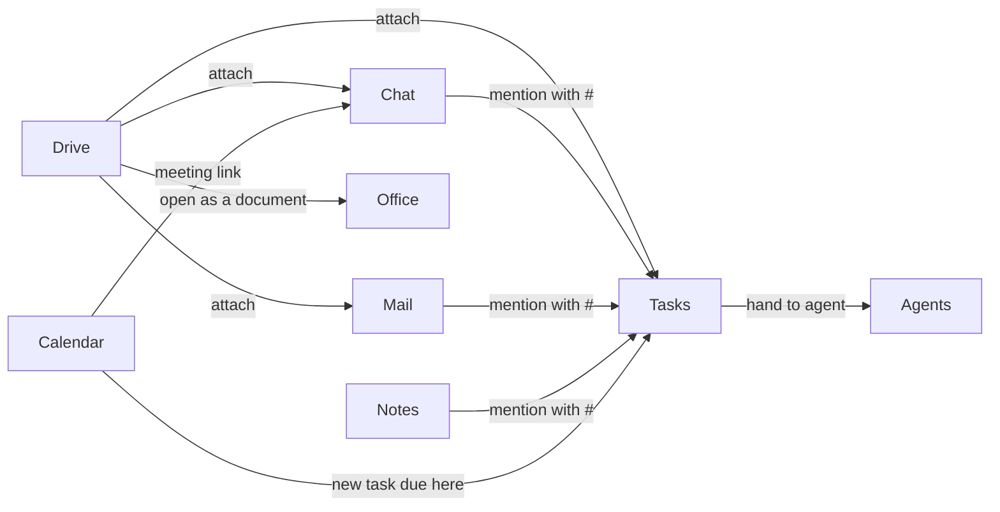

## Built in for every app you deploy

These work for any service Polaris deploys, with no SDK, agent or change to the app's code: they run at the edge or on the host.

|                                                                                                                                                                                                                                                    | Instead of                               | Polaris                                                                                                                               |
| -------------------------------------------------------------------------------------------------------------------------------------------------------------------------------------------------------------------------------------------------- | ---------------------------------------- | ------------------------------------------------------------------------------------------------------------------------------------- |
|   | Google Analytics, Plausible              | **Analytics** read from the edge's access log, with no script tag                                                                     |
|                                                                                                                                             | Cloudflare WAF and Access                | **Firewall** in front of every route: country and network rules, bot defences, injection scanning, bans, and an optional sign-in wall |
|                                                                                                                           | Beekeeper Studio and other database GUIs | **Databases**: browse and query Postgres, MySQL, MariaDB, MongoDB and Redis                                                           |
|                                                                                                                                          | Uptime Kuma and other uptime checkers    | **Watch**: every domain probed, a sustained outage alerted                                                                            |
|                                                                                                                                                      | Datadog and other metrics agents         | **Metrics** for every container and server, read over SSH and Docker                                                                  |
|                                                                                                                                     | Certbot                                  | **HTTPS**: Let's Encrypt certificates issued and renewed for each public domain                                                       |

 Error tracking is the exception: **Telemetry** takes events from the Sentry SDK your app already uses, so the one change is the DSN.

## How it works

### Updating

The Update button in Settings is how an installed Polaris is updated. The limited edition has no host daemon, so there the button reports that updates are unavailable.

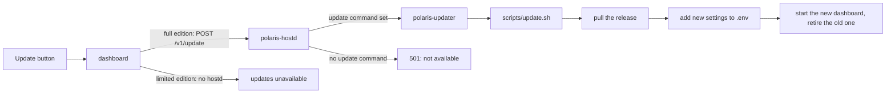

### A request through the edge

Every router has an explicit priority, highest first. Routes with firewall rules pass through the guard before reaching the app.

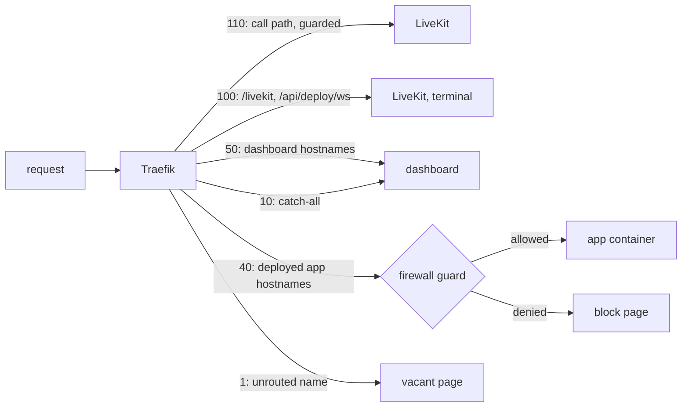

### Deploying an app

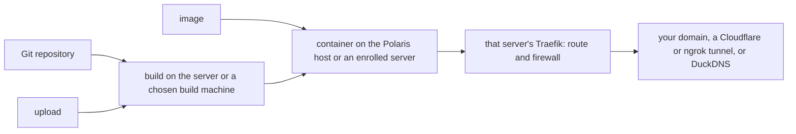

### Repository layout

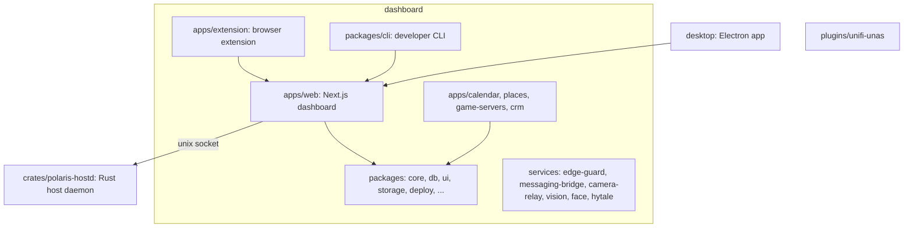

## Usage

Once it is up, open the dashboard and create your account - **the first account
becomes the administrator**.

**Reach it by name**, Home-Assistant style: the stack advertises itself over mDNS,
so any device on your network can open **`http://polaris.local`**, and the machine
running Polaris also resolves bare **`http://polaris`**.

An install is one thing, with nothing to choose: the privileged host daemon that
lets Polaris manage the machine it runs on - mounts, the Docker engine, its own
updates - is part of it, along with the dedicated key it uses to reach that
machine's Docker engine and the `polaris` command for the host.

A native app for Windows, macOS and Linux (Account > Preferences) opens an
instance in its own window with system notices, log windows and pushing a
local build to it; see [`desktop/README.md`](desktop/README.md).

## Requirements

[Docker Engine](https://docs.docker.com/engine/install/) with the Compose v2
plugin. That's it. For local development without containers, see the
[developer guide](docs/developers/README.md).

**Run it on Linux** - Ubuntu Server is what it is developed and run against.
Polaris manages the machine it lives on, and that means privileged mounts, the
host's Docker engine and host networking, all of which are native there.

On Windows, Docker runs inside WSL, so the host Polaris would be managing is that
virtual machine rather than the machine you installed it on: privileged mounts
and host networking behave differently or not at all. It is not recommended as
the host. A Windows machine is a perfectly good **server to add** to a Polaris
running elsewhere, managed from it like any other.

## Contributing

How to report a bug, propose a change and open a pull request is in
[CONTRIBUTING.md](CONTRIBUTING.md); everyone taking part follows the
[code of conduct](CODE_OF_CONDUCT.md). The monorepo layout, the development
loop, how to build and test the dashboard and the Rust components, and the
release flow all live in the [developer guide](docs/developers/README.md).

## License

Polaris is licensed under the [GNU AGPL-3.0](LICENSE) with the additional terms
in [NOTICE.md](NOTICE.md):

- Use it, change it and share it, commercially too, under the AGPL-3.0.
- A modified version - distributed, or offered to people over a network - must
  publish its full source under the same license. Closed-source forks are not
  allowed.
- A modified version must say visibly that it is based on Polaris.

To use Polaris outside those terms, for example in a closed-source product or a
hosted service whose source you do not publish, ask for a commercial license
(see [NOTICE.md](NOTICE.md)). Releases published before this change remain
under Apache-2.0.

To cite Polaris, use [CITATION.cff](CITATION.cff).
