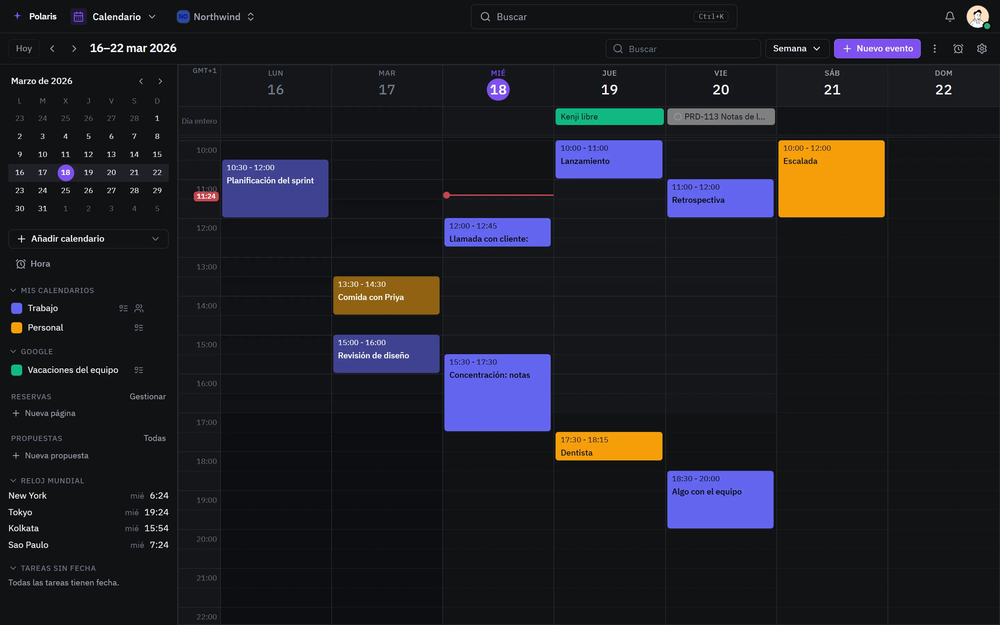
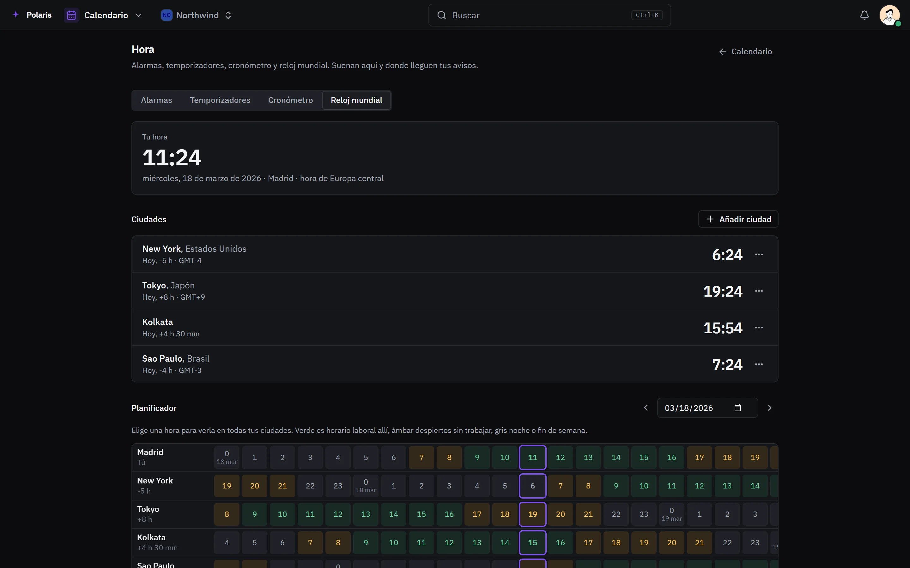

# Calendario

[Read in English](calendar.md) - [Volver al README](../../README.es.md)

Tus calendarios y los que enlaces - Google, Microsoft 365, cualquier servidor
CalDAV o un feed ICS - en un sitio, sincronizados en los dos sentidos.

Cada imagen es la interfaz real dibujada con personas y datos inventados, y
sigue tu ajuste claro u oscuro. Las versiones para móvil están en
[docs/assets/media](../assets/media).

## La semana

<picture>
  <source media="(prefers-color-scheme: light)" srcset="../assets/media/calendar-light-es-desktop.webp">
  
</picture>

Vistas de día, semana, mes y año. Un evento admite invitaciones con respuesta,
recordatorios, repeticiones, ubicación y enlace de reunión, y los invitados
pueden proponer otra hora. Libre/ocupado muestra cuándo pueden los demás, y las
salas se reservan como a una persona. Las tareas con fecha aparecen en la
cuadrícula, y las que no tienen se fechan desde un panel lateral.

## Hora

<picture>
  <source media="(prefers-color-scheme: light)" srcset="../assets/media/calendar-time-light-es-desktop.webp">
  
</picture>

El área Hora del calendario reúne alarmas, temporizadores con ciclos de
concentración, cronómetro y reloj mundial. El reloj mundial alinea tus ciudades
hora a hora, para encontrar una que le venga bien a todos.

## Compartir

Comparte un calendario con personas o equipos, desde solo libre/ocupado hasta
gestionarlo, o publícalo con un enlace público. Las páginas de reserva dejan a
gente de fuera reservar un hueco en las horas que ofreces, con sus propias
preguntas. Los calendarios se importan y exportan como ICS, y se imprimen.
