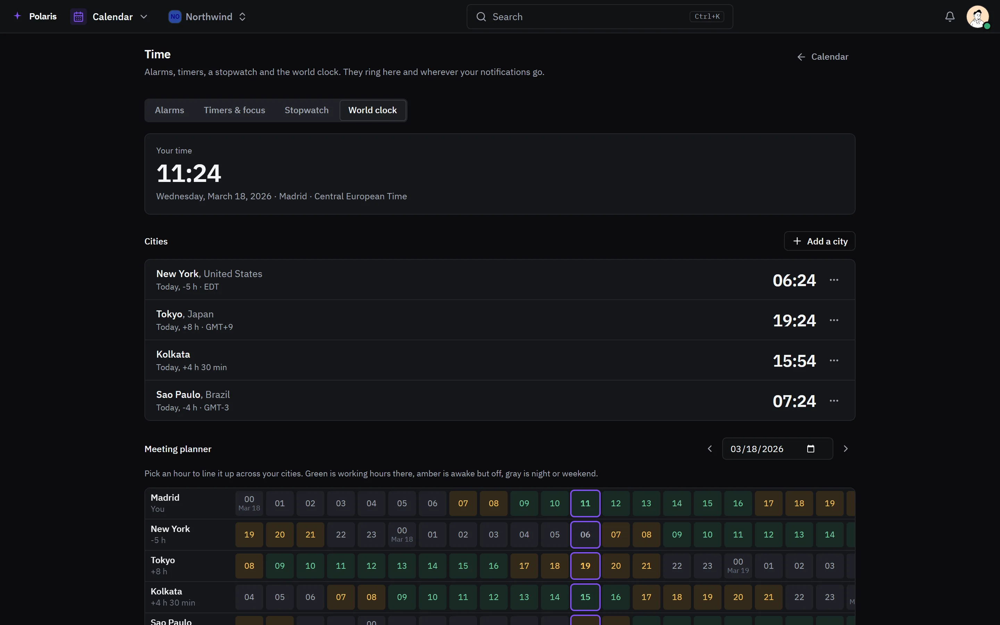

# Calendar

[Leer en español](calendar.es.md) - [Back to the README](../../README.md)

Your calendars and the ones you link - Google, Microsoft 365, any CalDAV server
or an ICS feed - in one place, synced both ways.

Every picture is the real interface drawn with made-up people and data, and
follows your light or dark setting. Phone-sized versions are in
[docs/assets/media](../assets/media).

## The week

<picture>
  <source media="(prefers-color-scheme: light)" srcset="../assets/media/calendar-light-en-desktop.webp">
  
</picture>

Day, week, month and year views. An event takes invitations with answers,
reminders, repeats, a location and a meeting link, and the people invited can
propose another time. Free/busy shows when others are available, and meeting
rooms are booked like people. Tasks with a due date show on the grid, and
tasks without one can be given one from a side panel.

## Time

<picture>
  <source media="(prefers-color-scheme: light)" srcset="../assets/media/calendar-time-light-en-desktop.webp">
  
</picture>

Calendar's Time area holds alarms, timers with focus cycles, a stopwatch and a
world clock. The world clock lines your cities up hour by hour, so a time that
suits everybody is easy to find.

## Sharing

Share a calendar with people or teams, from free/busy only to managing it, or
publish it as a public link. Booking pages let people outside reserve a slot
in the hours you offer, with their own questions. Calendars import and export
as ICS, and print.
