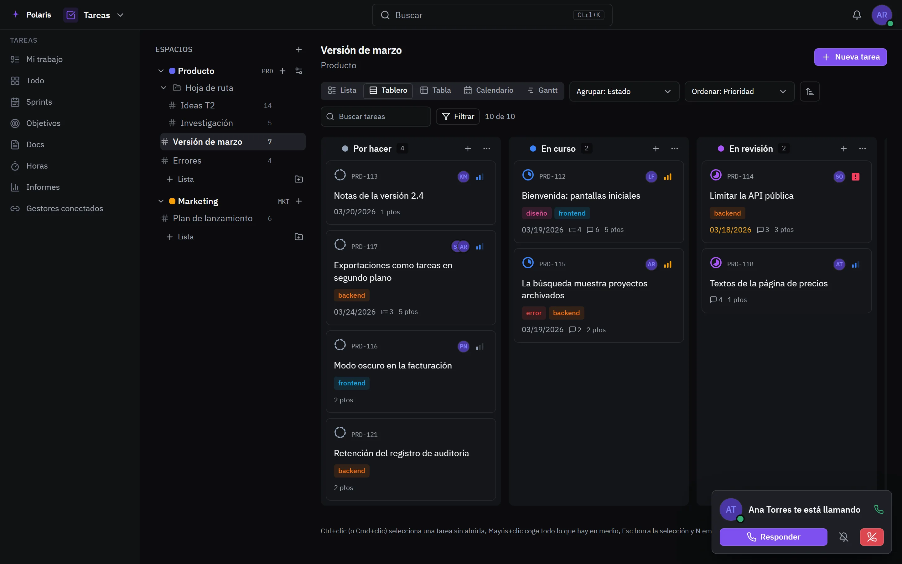
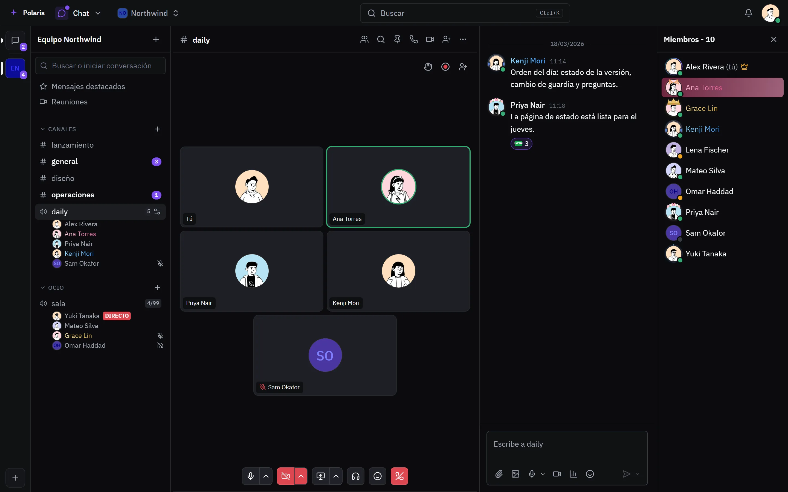
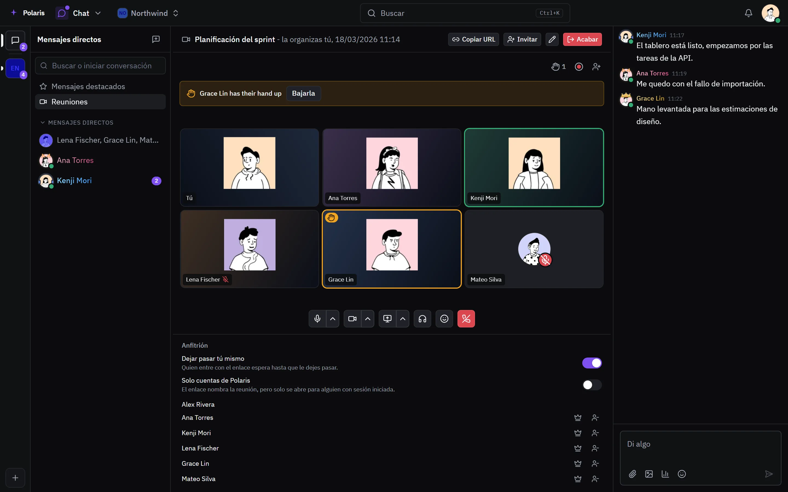
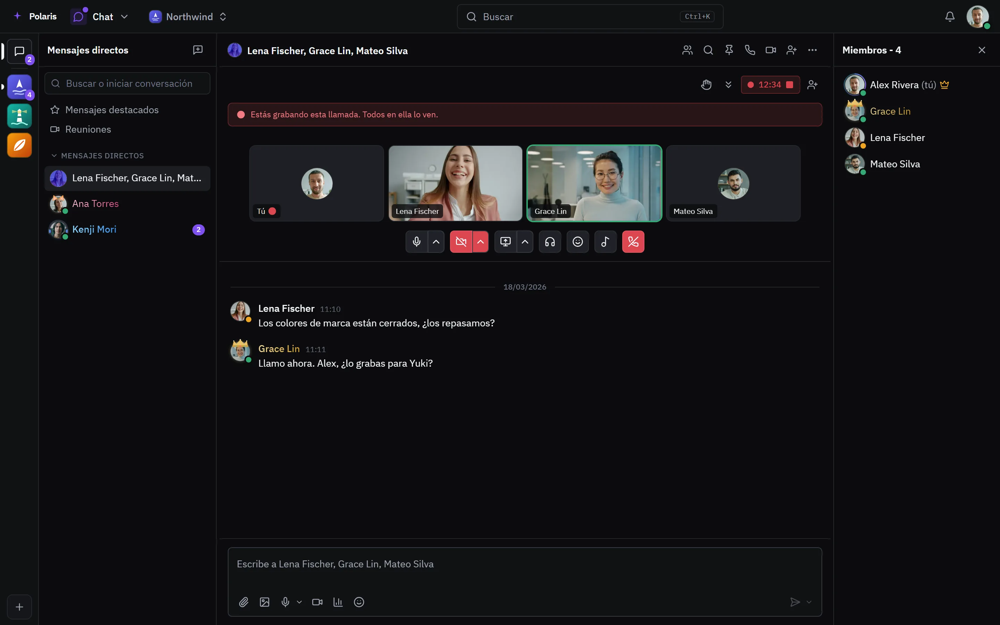

# Llamadas

[Read in English](calls.md) - [Volver al README](../../README.es.md)

Voz y vídeo en tres sitios: un canal de voz al que la gente entra cuando
quiere, una reunión con su propio enlace y una llamada dentro de un mensaje
directo o un chat de grupo. Las llamadas van por tu propio servidor, con
pantalla compartida, grabación y supresión de ruido. La parte de texto está en
la página de [Chat](chat.es.md).

Cada imagen es la interfaz real dibujada con personas y datos inventados, y
sigue tu ajuste claro u oscuro. Las versiones para móvil están en
[docs/assets/media](../assets/media).

## Una llamada suena estés donde estés

<picture>
  <source media="(prefers-color-scheme: light)" srcset="../assets/media/call-light-es-desktop.webp">
  
</picture>

Una llamada entrante aparece sobre la app que tengas abierta, y desde ahí la
contestas, la silencias o la rechazas. Una vez dentro, la llamada te acompaña
mientras cambias de app.

## Canales de voz

<picture>
  <source media="(prefers-color-scheme: light)" srcset="../assets/media/in-call-light-es-desktop.webp">
  
</picture>

Un canal de voz siempre está abierto: entras y ya estás dentro. La barra
lateral muestra quién hay en cada uno, quién tiene el micro o el sonido
silenciado o comparte pantalla, y cuánto se ha llenado frente a su límite. El
canal tiene un chat de texto junto a la llamada.

## Reuniones

<picture>
  <source media="(prefers-color-scheme: light)" srcset="../assets/media/call-meeting-light-es-desktop.webp">
  
</picture>

Una reunión tiene su propio enlace, así que quien no tiene cuenta puede entrar
como invitado. El anfitrión decide si todos los del enlace esperan a que los
deje pasar o solo entran cuentas con sesión iniciada, puede pasarle la reunión
a otra persona y puede echar a alguien. Las manos levantadas se ven arriba de
la llamada, y la reunión tiene su propio chat.

## Llamadas en mensajes directos y grupos

<picture>
  <source media="(prefers-color-scheme: light)" srcset="../assets/media/call-group-light-es-desktop.webp">
  
</picture>

Cualquier mensaje directo o chat de grupo puede empezar una llamada de voz o de
vídeo. La llamada se graba en el navegador de quien empieza la grabación, todos
los que están dentro lo ven, y después la grabación se envía a la conversación
o se descarta.
