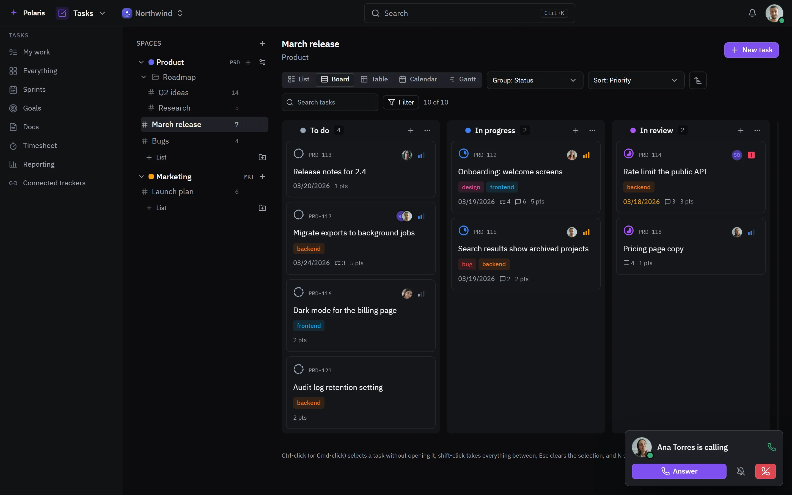
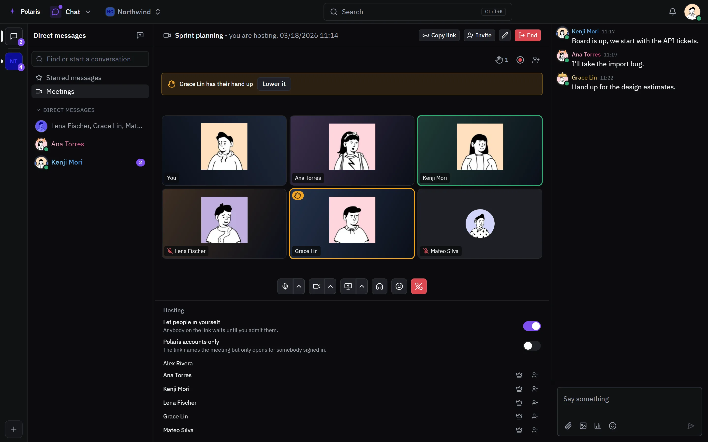
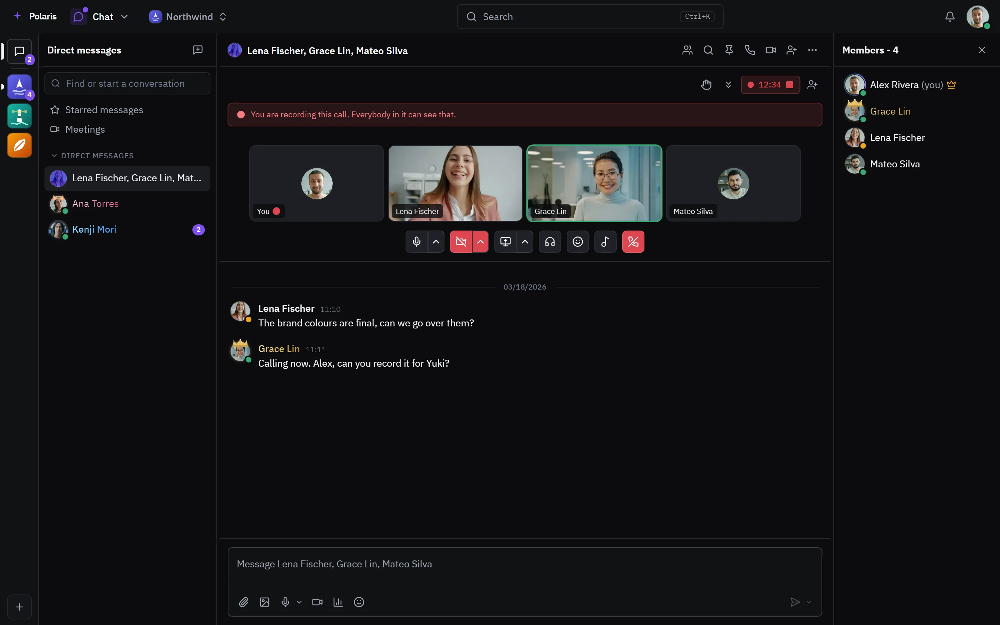

# Calls

[Leer en español](calls.es.md) - [Back to the README](../../README.md)

Voice and video in three places: a voice channel people drop into, a meeting
with a link of its own, and a call inside a direct message or group chat. Calls
run on your own server, with screen sharing, recording and noise suppression.
The text side is on the [Chat](chat.md) page.

Every picture is the real interface drawn with made-up people and data, and
follows your light or dark setting. Phone-sized versions are in
[docs/assets/media](../assets/media).

## A call rings wherever you are

<picture>
  <source media="(prefers-color-scheme: light)" srcset="../assets/media/call-light-en-desktop.webp">
  
</picture>

An incoming call shows over whichever app is open, where you can answer,
silence or decline it. Once you are in, the call stays with you as you move
between apps.

## Voice channels

<picture>
  <source media="(prefers-color-scheme: light)" srcset="../assets/media/in-call-light-en-desktop.webp">
  
</picture>

A voice channel is always open: join it and you are in. The sidebar lists who
is inside each one, who is muted, deafened or sharing a screen, and how full it
is against its limit. The channel keeps a text chat next to the call.

## Meetings

<picture>
  <source media="(prefers-color-scheme: light)" srcset="../assets/media/call-meeting-light-en-desktop.webp">
  
</picture>

A meeting has its own link, so people without an account can join as guests.
The host decides whether everybody on the link waits to be let in or only
signed-in accounts get through, can hand the meeting to somebody else, and can
remove people. Raised hands show at the top of the call, and the meeting has a
chat of its own.

## Calls in direct messages and groups

<picture>
  <source media="(prefers-color-scheme: light)" srcset="../assets/media/call-group-light-en-desktop.webp">
  
</picture>

Any direct message or group chat can start a voice or video call. A call is
recorded in the browser of whoever starts it, everybody in it sees that it is,
and the recording can then be sent to the conversation or thrown away.
