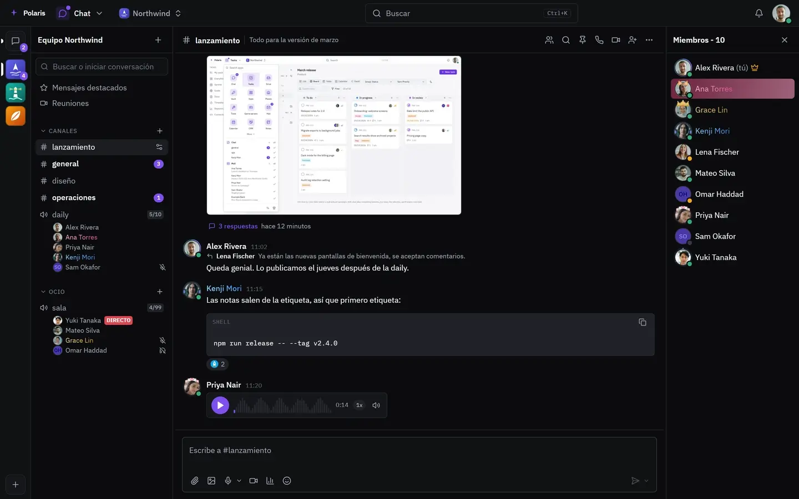
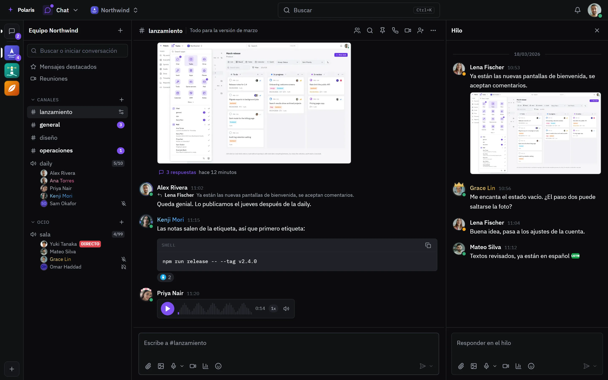
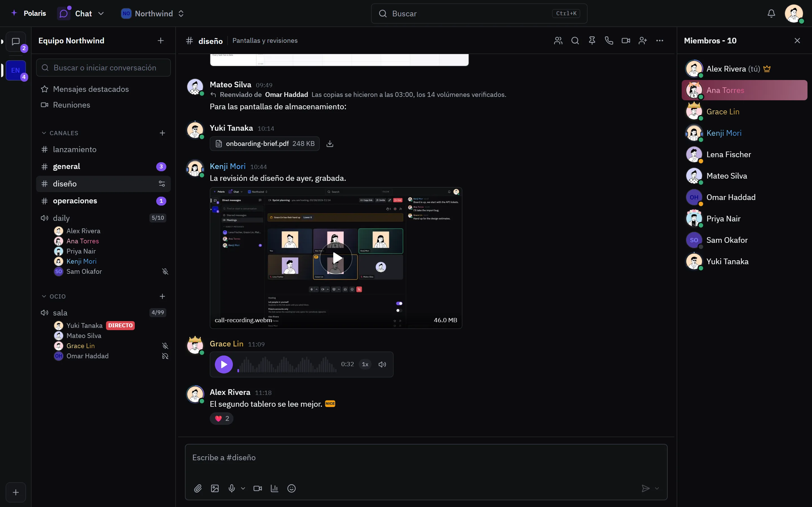
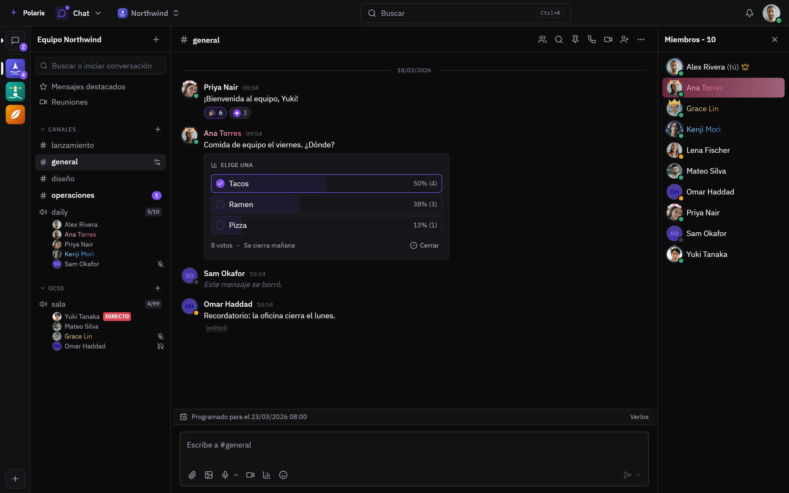
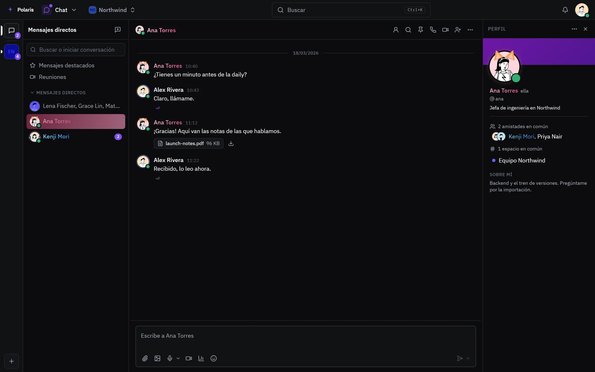
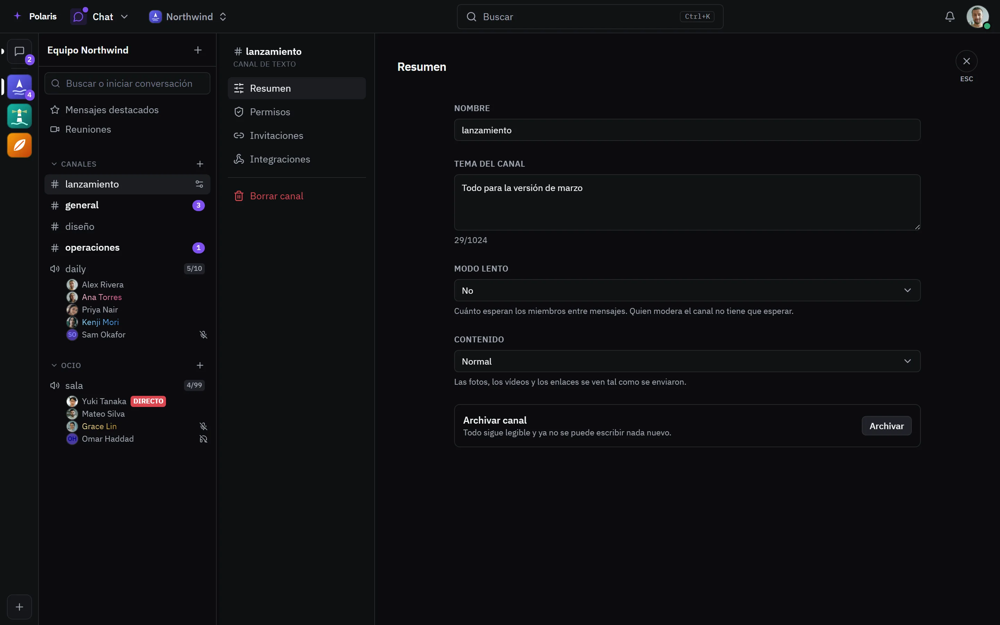
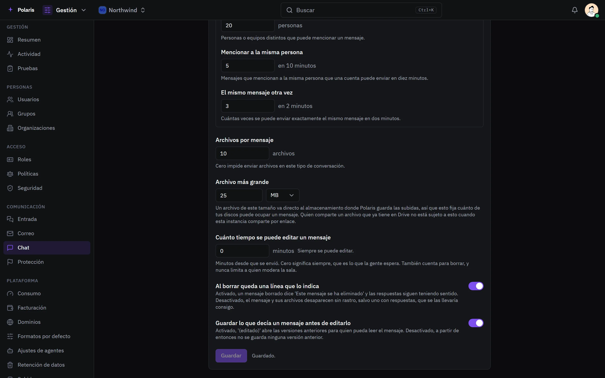
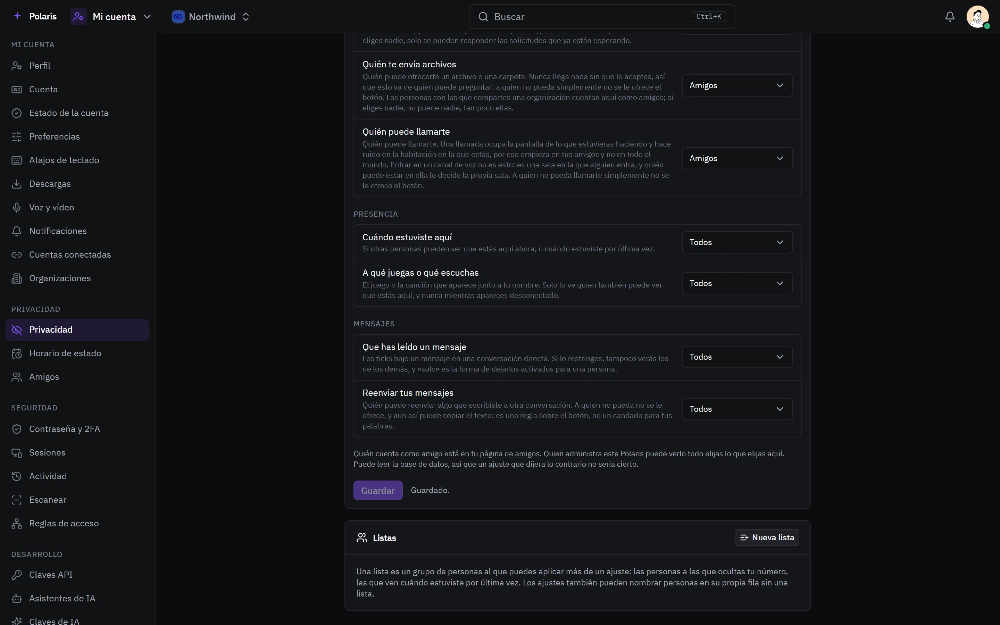

# Chat

[Read in English](chat.md) - [Volver al README](../../README.es.md)

Espacios con canales de texto y de voz, chats de grupo y mensajes directos,
para todos los que tienen cuenta en tu Polaris. Las llamadas tienen su propia
página: [Llamadas](calls.es.md).

Cada imagen es la interfaz real dibujada con personas y datos inventados, y
sigue tu ajuste claro u oscuro. Las versiones para móvil están en
[docs/assets/media](../assets/media).

## Canales

<picture>
  <source media="(prefers-color-scheme: light)" srcset="../assets/media/chat-light-es-desktop.webp">
  
</picture>

Un espacio agrupa sus canales en categorías. La barra lateral muestra quién
está en cada canal de voz, quién tiene el micro o el sonido silenciado, quién
comparte pantalla (DIRECTO) y cuánto se ha llenado la sala frente a su límite.
Los mensajes admiten reacciones con emoji estándar o propios del espacio, citan
el mensaje al que responden y usan Markdown, con bloques de código que se
copian con un botón. Los mensajes de voz se reproducen ahí mismo, con su onda y
un control de velocidad.

Las decoraciones de perfil, los colores de nombre y las placas aparecen allí
donde aparece un nombre.

## Hilos

<picture>
  <source media="(prefers-color-scheme: light)" srcset="../assets/media/chat-thread-light-es-desktop.webp">
  
</picture>

Cualquier mensaje puede abrir un hilo. El canal muestra cuántas respuestas
tiene, y el hilo se abre junto a la conversación con su propio cuadro de
escritura. En el móvil ocupa toda la pantalla.

## Archivos, grabaciones y reenvíos

<picture>
  <source media="(prefers-color-scheme: light)" srcset="../assets/media/chat-media-light-es-desktop.webp">
  
</picture>

Imágenes, documentos, vídeos y llamadas grabadas se envían desde el cuadro de
escritura y se reproducen o se previsualizan en la conversación. Un mensaje
reenviado conserva quién lo escribió y dónde. Cuántos archivos lleva un
mensaje, y de qué tamaño, se decide en las reglas de más abajo.

## Encuestas, mensajes programados y ediciones

<picture>
  <source media="(prefers-color-scheme: light)" srcset="../assets/media/chat-poll-light-es-desktop.webp">
  
</picture>

Una encuesta cuenta los votos en directo y se cierra sola o cuando su autor la
termina. Un mensaje se puede programar para más tarde; la barra sobre el cuadro
de escritura muestra lo que está en cola. Los mensajes editados quedan
marcados, y uno borrado deja una línea que lo dice, salvo que las reglas de más
abajo lo desactiven.

## Mensajes directos

<picture>
  <source media="(prefers-color-scheme: light)" srcset="../assets/media/chat-direct-light-es-desktop.webp">
  
</picture>

Conversaciones de uno a uno y de grupo, con marcas de leído y entregado. El
panel de perfil muestra la biografía, los pronombres, los amigos y espacios en
común, y la decoración y el banner de esa persona.

## Ajustes del canal

<picture>
  <source media="(prefers-color-scheme: light)" srcset="../assets/media/chat-channel-settings-light-es-desktop.webp">
  
</picture>

Cada canal tiene nombre, tema, modo lento, cómo se ven las imágenes y las
tarjetas de enlace, permisos, enlaces de invitación e integraciones. Archivarlo
deja todos los mensajes legibles e impide escribir nada nuevo.

## Reglas para toda la instancia

<picture>
  <source media="(prefers-color-scheme: light)" srcset="../assets/media/chat-rules-light-es-desktop.webp">
  
</picture>

Los administradores fijan reglas distintas para espacios, chats de grupo y
mensajes directos: a cuánta gente puede mencionar un mensaje, mensajes
repetidos, cuántos archivos y de qué tamaño, cuánto tiempo se puede editar un
mensaje, si un mensaje borrado deja rastro y si se guardan las versiones
anteriores de uno editado.

## Tu privacidad

<picture>
  <source media="(prefers-color-scheme: light)" srcset="../assets/media/chat-privacy-light-es-desktop.webp">
  
</picture>

Cada persona decide quién puede pedirle amistad, enviarle archivos y llamarla,
quién ve cuándo estuvo aquí y a qué juega, si los demás ven que ha leído un
mensaje y quién puede reenviar lo que escribe. Una lista nombra a un grupo de
personas una vez, para cualquiera de estos ajustes.
