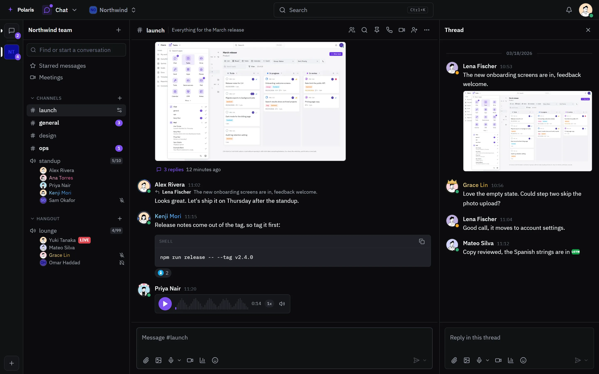
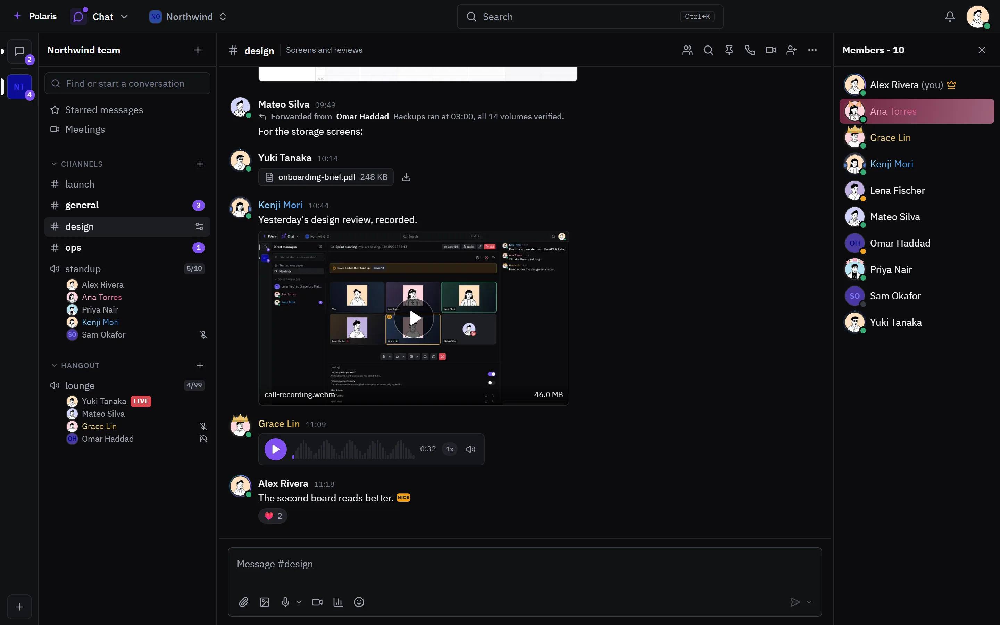
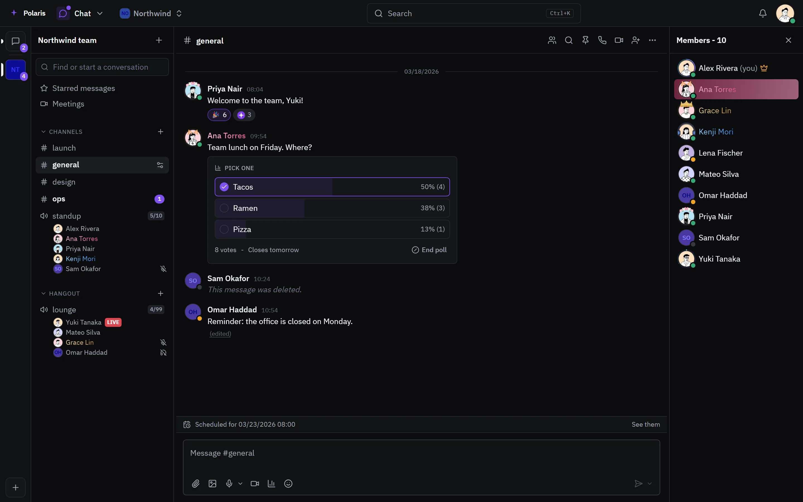
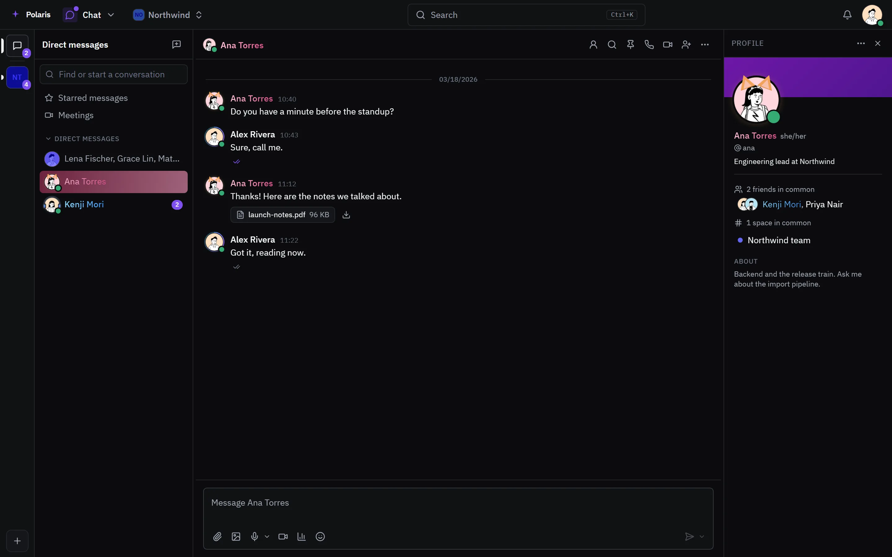
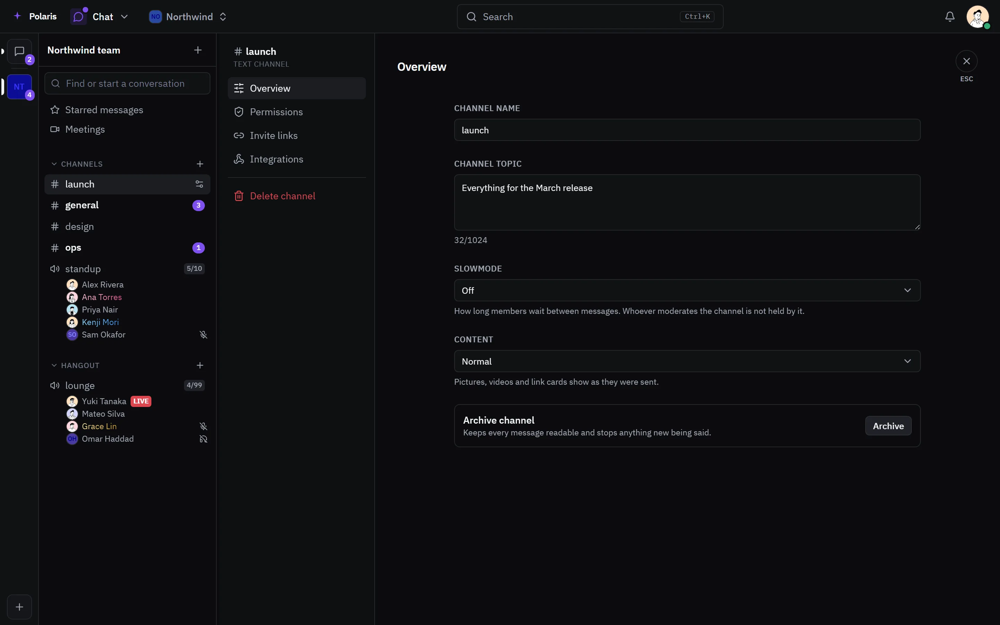
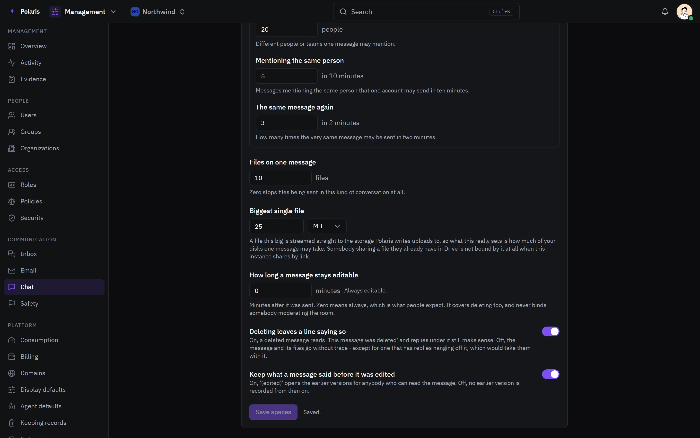
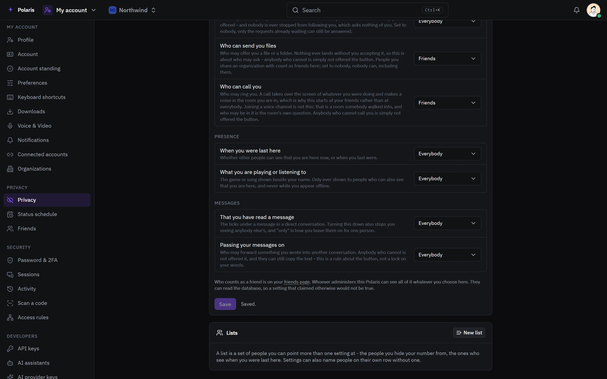

# Chat

[Leer en español](chat.es.md) - [Back to the README](../../README.md)

Spaces with text and voice channels, group chats and direct messages, for
everybody with an account on your Polaris. Calls are covered on their own page:
[Calls](calls.md).

Every picture is the real interface drawn with made-up people and data, and
follows your light or dark setting. Phone-sized versions are in
[docs/assets/media](../assets/media).

## Channels

<picture>
  <source media="(prefers-color-scheme: light)" srcset="../assets/media/chat-light-en-desktop.webp">
  
</picture>

A space groups its channels into categories. The sidebar shows who is in each
voice channel, who is muted or deafened, who is sharing a screen (LIVE), and
how full the room is against its limit. Messages take reactions with standard
or the space's own emoji, quote the message they reply to, and render Markdown,
including code blocks with a copy button. Voice messages play in place with
their waveform and a speed control.

Profile decorations, name colors and nameplates show wherever a name does.

## Threads

<picture>
  <source media="(prefers-color-scheme: light)" srcset="../assets/media/chat-thread-light-en-desktop.webp">
  
</picture>

Any message can start a thread. The channel keeps a reply count under it, and
the thread opens beside the conversation with a composer of its own. On a phone
it takes the whole screen.

## Files, recordings and forwards

<picture>
  <source media="(prefers-color-scheme: light)" srcset="../assets/media/chat-media-light-en-desktop.webp">
  
</picture>

Pictures, documents, video and recorded calls are sent from the composer and
play or preview in the conversation. A forwarded message keeps who wrote it and
where. How many files a message carries, and how large, is set in the rules
below.

## Polls, scheduled messages and edits

<picture>
  <source media="(prefers-color-scheme: light)" srcset="../assets/media/chat-poll-light-en-desktop.webp">
  
</picture>

A poll counts votes live and closes on its own or when its author ends it. A
message can be scheduled for later; the bar over the composer shows what is
queued. Edited messages are marked, and a deleted one leaves a line saying so,
unless the rules below turn that off.

## Direct messages

<picture>
  <source media="(prefers-color-scheme: light)" srcset="../assets/media/chat-direct-light-en-desktop.webp">
  
</picture>

One-to-one and group conversations, with read and delivered ticks. The profile
panel shows the person's bio, pronouns, the friends and spaces you share, and
their decoration and banner.

## Channel settings

<picture>
  <source media="(prefers-color-scheme: light)" srcset="../assets/media/chat-channel-settings-light-en-desktop.webp">
  
</picture>

Each channel has a name, a topic, slowmode, how pictures and link cards show,
permissions, invite links and integrations. Archiving keeps every message
readable and stops anything new.

## Rules for the whole instance

<picture>
  <source media="(prefers-color-scheme: light)" srcset="../assets/media/chat-rules-light-en-desktop.webp">
  
</picture>

Administrators set rules separately for spaces, group chats and direct
messages: how many people one message may mention, repeated messages, how many
files and how large, how long a message stays editable, whether a deleted
message leaves a trace, and whether earlier versions of an edited message are
kept.

## Your privacy

<picture>
  <source media="(prefers-color-scheme: light)" srcset="../assets/media/chat-privacy-light-en-desktop.webp">
  
</picture>

Each person decides who can ask to be their friend, send them files and call
them, who sees when they were last here and what they are playing, whether
others see that they read a message, and who may forward what they write. A
list names a group of people once, for any of these settings.
