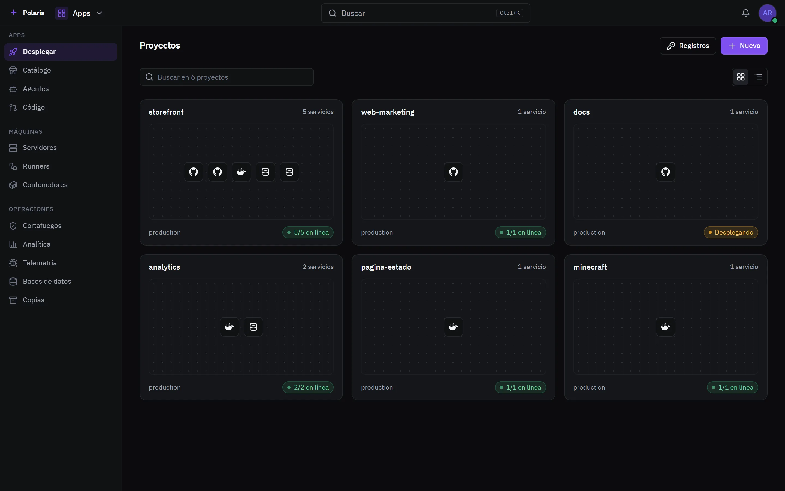
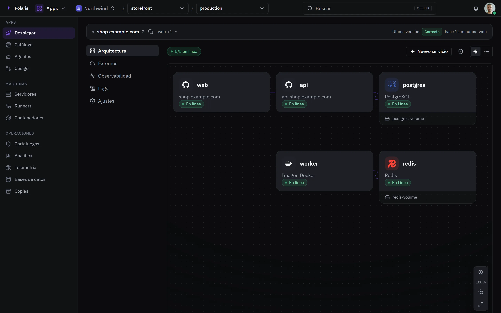
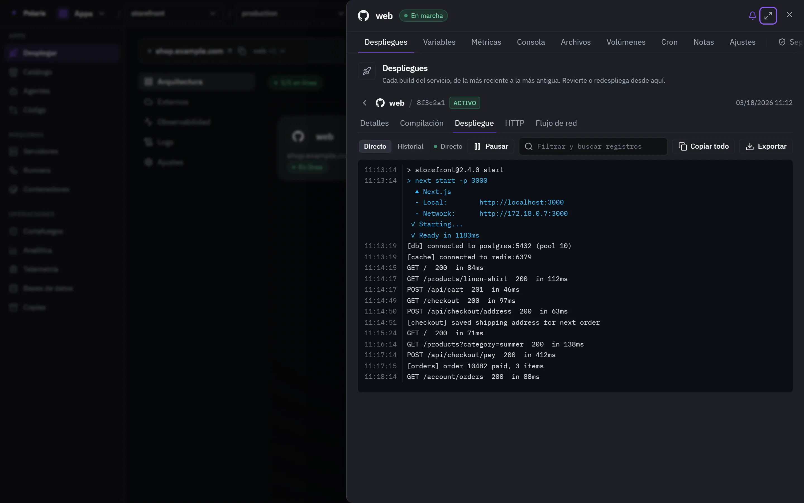

# Deploy

[Read in English](deploy.md) - [Volver al README](../../README.es.md)

Ejecuta apps en tus propias máquinas desde un repositorio Git, una imagen o una
subida, con sus bases de datos, volúmenes y dominios. Los proyectos de Vercel,
Railway y AWS aparecen al lado.

Cada imagen es la interfaz real dibujada con personas y datos inventados, y
sigue tu ajuste claro u oscuro. Las versiones para móvil están en
[docs/assets/media](../assets/media).

## Tus proyectos

<picture>
  <source media="(prefers-color-scheme: light)" srcset="../assets/media/deploy-light-es-desktop.webp">
  
</picture>

Cada proyecto muestra sus servicios y si están en marcha. Los proyectos son
tuyos o de una organización, que es lo que cambia el selector de la cabecera.

## El lienzo de un proyecto

<picture>
  <source media="(prefers-color-scheme: light)" srcset="../assets/media/deploy-project-light-es-desktop.webp">
  
</picture>

Un proyecto es un lienzo de servicios, bases de datos y volúmenes, con las
líneas que los unen. Puede tener varios entornos, cada uno vacío o copiado de
otro. Los cambios esperan en un aviso hasta que alguien los despliega, así que
un servicio eliminado no se elimina hasta entonces.

## Versiones y logs

<picture>
  <source media="(prefers-color-scheme: light)" srcset="../assets/media/deploy-logs-light-es-desktop.webp">
  
</picture>

Cada servicio tiene sus despliegues, variables, métricas, una consola, sus
archivos, volúmenes, tareas programadas, notas, ajustes, seguridad y analítica.
Una versión emite su log en directo. Si falla, Polaris lee el log, dice qué es
lo más probable que fallara y ofrece el arreglo en un clic.

## Llegar a él

Acceso público con tu propio dominio y un certificado de Let's Encrypt, un
túnel de Cloudflare o un nombre de DuckDNS; los servicios también se hablan por
una red privada propia. Cada ruta puede ir detrás del firewall y de un muro de
inicio de sesión opcional, y cada dominio se vigila. Las bases de datos -
Postgres, MySQL, MariaDB, MongoDB y Redis - se exploran, consultan y respaldan
desde el mismo sitio.
