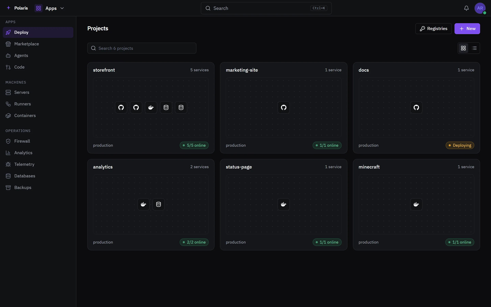
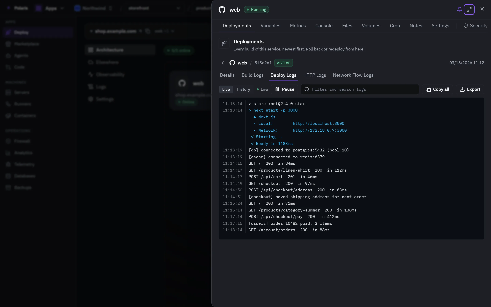

# Deploy

[Leer en español](deploy.es.md) - [Back to the README](../../README.md)

Run apps on your own machines from a Git repository, an image or an upload,
with their databases, volumes and domains. Projects on Vercel, Railway and AWS
sit beside them.

Every picture is the real interface drawn with made-up people and data, and
follows your light or dark setting. Phone-sized versions are in
[docs/assets/media](../assets/media).

## Your projects

<picture>
  <source media="(prefers-color-scheme: light)" srcset="../assets/media/deploy-light-en-desktop.webp">
  
</picture>

Every project shows its services and whether they are up. Projects belong to
you or to an organization, which is what the switch in the header changes.

## A project's canvas

<picture>
  <source media="(prefers-color-scheme: light)" srcset="../assets/media/deploy-project-light-en-desktop.webp">
  
</picture>

A project is a canvas of services, databases and volumes, with the lines
between them. A project can have several environments, each started empty or
as a copy of another. Changes wait in a banner until somebody deploys them, so
a removed service is not removed until then.

## Releases and logs

<picture>
  <source media="(prefers-color-scheme: light)" srcset="../assets/media/deploy-logs-light-en-desktop.webp">
  
</picture>

Each service has its deployments, variables, metrics, a console, its files,
volumes, scheduled jobs, notes, settings, security and analytics. A release
streams its log live. When one fails, Polaris reads the log, says what most
likely went wrong, and offers the fix as one press.

## Reaching it

Public access through your own domain with a Let's Encrypt certificate, a
Cloudflare tunnel or a DuckDNS name; services can also talk over a private
network of their own. Every route can sit behind the firewall and an optional
sign-in wall, and every domain is probed for uptime. Databases - Postgres,
MySQL, MariaDB, MongoDB and Redis - are browsed, queried and backed up from
the same place.
