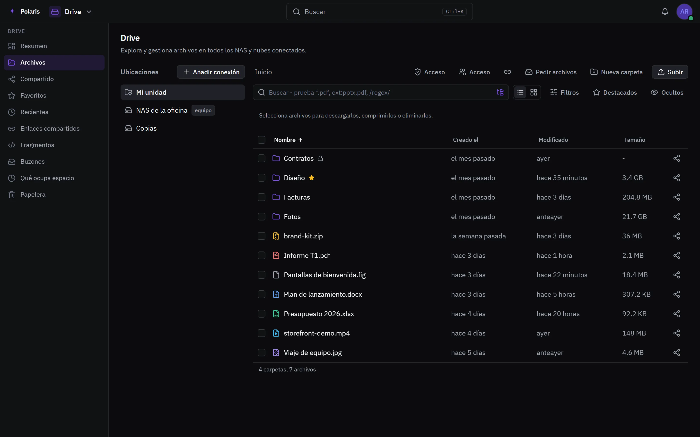
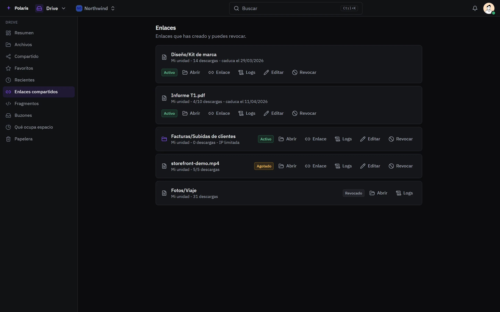

# Drive

[Read in English](drive.md) - [Volver al README](../../README.es.md)

Un explorador para tu propia unidad y todo el almacenamiento que conectes:
discos locales, SFTP, buckets compatibles con S3, recursos SMB y NFS, UniFi
UNAS, Google Drive, OneDrive y Dropbox. Cada cuenta tiene una unidad privada y
cada organización una estantería para sus miembros.

Cada imagen es la interfaz real dibujada con personas y datos inventados, y
sigue tu ajuste claro u oscuro. Las versiones para móvil están en
[docs/assets/media](../assets/media).

## Todo el almacenamiento en un sitio

<picture>
  <source media="(prefers-color-scheme: light)" srcset="../assets/media/drive-light-es-desktop.webp">
  
</picture>

Las subidas y descargas van en streaming, así que un archivo de varios gigas
nunca se queda cargando. Imágenes y documentos muestran su propia vista en
lugar de un icono genérico, y documentos, hojas de cálculo, PDF y multimedia se
abren en un visor. Las carpetas admiten favoritos, bloqueo y reglas de acceso
por persona, grupo o rol. "Dónde se fue el espacio" recorre una ubicación y
muestra qué ocupa más.

## Enlaces que has repartido

<picture>
  <source media="(prefers-color-scheme: light)" srcset="../assets/media/drive-links-light-es-desktop.webp">
  
</picture>

Un archivo o carpeta sale como enlace público con contraseña, caducidad,
límite de descargas, rango de direcciones y lo que puede hacer quien lo abre -
ver, descargar, subir, renombrar. Cada enlace guarda un registro de quién lo
abrió y desde dónde, y se revoca al momento.

## Compartir con personas

- **Comparte** un archivo o carpeta con una persona o un grupo, con un rol, una
  nota y una caducidad.
- **Envía** un archivo o carpeta a una persona o una organización: una copia
  por defecto, que se queda con quien la envía hasta que se acepta.
- **Puntos de entrega** para recoger archivos, o texto, de gente sin cuenta.
- **Fragmentos** para repartir texto por enlace, con los mismos límites que un
  archivo compartido.
