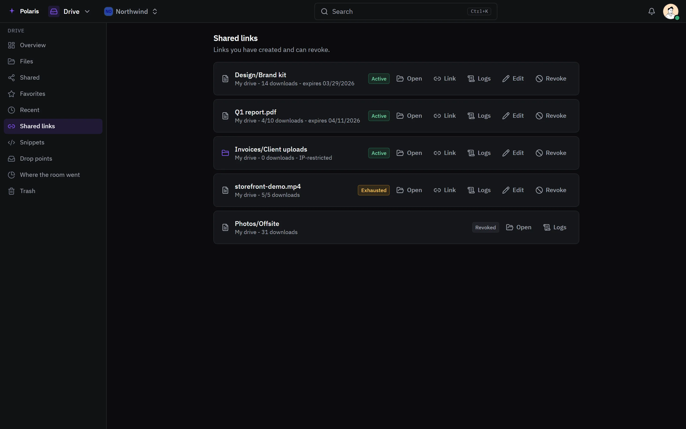

# Drive

[Leer en español](drive.es.md) - [Back to the README](../../README.md)

One explorer for your own drive and every storage you connect: local disks,
SFTP, S3-compatible buckets, SMB and NFS shares, UniFi UNAS, Google Drive,
OneDrive and Dropbox. Every account gets a private drive, and every
organization a shelf its members reach.

Every picture is the real interface drawn with made-up people and data, and
follows your light or dark setting. Phone-sized versions are in
[docs/assets/media](../assets/media).

## Every storage in one place

<picture>
  <source media="(prefers-color-scheme: light)" srcset="../assets/media/drive-light-en-desktop.webp">
  
</picture>

Uploads and downloads stream, so a multi-gigabyte file never buffers. Images
and documents show their own picture instead of a generic icon, and documents,
spreadsheets, PDFs and media open in a viewer. Folders take favorites, a lock,
and access rules per person, group or role. "Where the room went" walks a
location and shows what takes the space.

## Links you handed out

<picture>
  <source media="(prefers-color-scheme: light)" srcset="../assets/media/drive-links-light-en-desktop.webp">
  
</picture>

A file or folder goes out as a public link with a password, an expiry, a
download limit, an address range, and what a visitor may do - preview,
download, upload, rename. Each link keeps a log of who opened it and from
where, and can be revoked at once.

## Sharing with people

- **Share** a file or folder with a person or a group, with a role, a note and
  an expiry.
- **Send** a file or folder to a person or an organization: a copy by default,
  kept with the sender until it is accepted.
- **Drop points** collect files, or text, from people who have no account.
- **Snippets** hand out text by link, with the same limits as a shared file.
