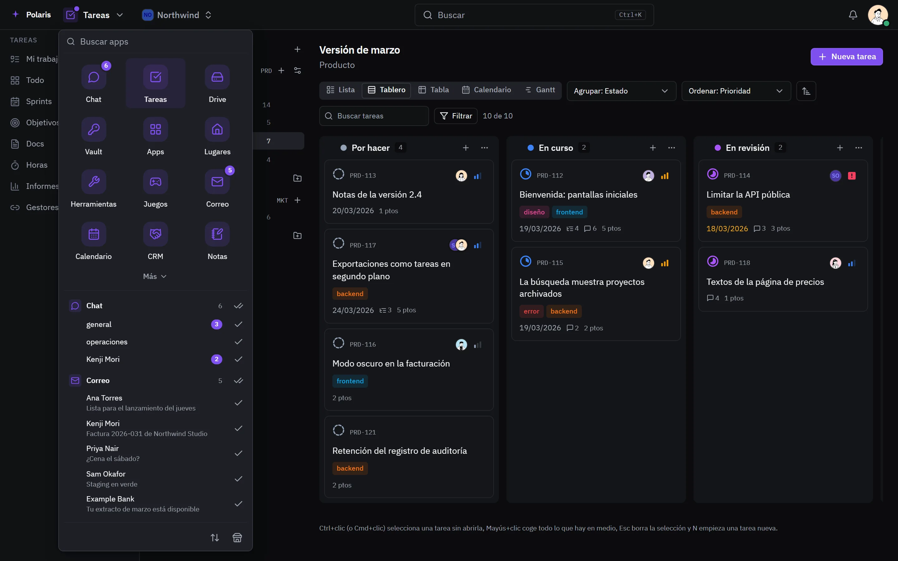

# Lanzador de apps

[Read in English](launcher.md) - [Volver al README](../../README.es.md)

El menú de la esquina superior izquierda abre todas las apps que puedes usar y
dice qué te espera en cada una.

Cada imagen es la interfaz real dibujada con personas y datos inventados, y
sigue tu ajuste claro u oscuro. Las versiones para móvil están en
[docs/assets/media](../assets/media).

## Todas las apps, un menú

<picture>
  <source media="(prefers-color-scheme: light)" srcset="../assets/media/launcher-light-es-desktop.webp">
  
</picture>

Los chats y correos sin leer, y lo que necesita a un administrador, se cuentan
en su app y se listan por nombre, así que un clic abre esa conversación. Las
apps se buscan, se marcan como favoritas y se ordenan arrastrando; las primeras
también aparecen en el Resumen. Las apps se activan por cuenta y por rol, y el
menú solo muestra las que puedes abrir.

## Personal u organización

El selector junto al nombre de la app, que aparece cuando la cuenta pertenece a
una organización, elige de quién es lo que ves: lo tuyo, o los proyectos,
espacios, archivos y dominios de una organización. Está en todas las imágenes
de estas páginas.
