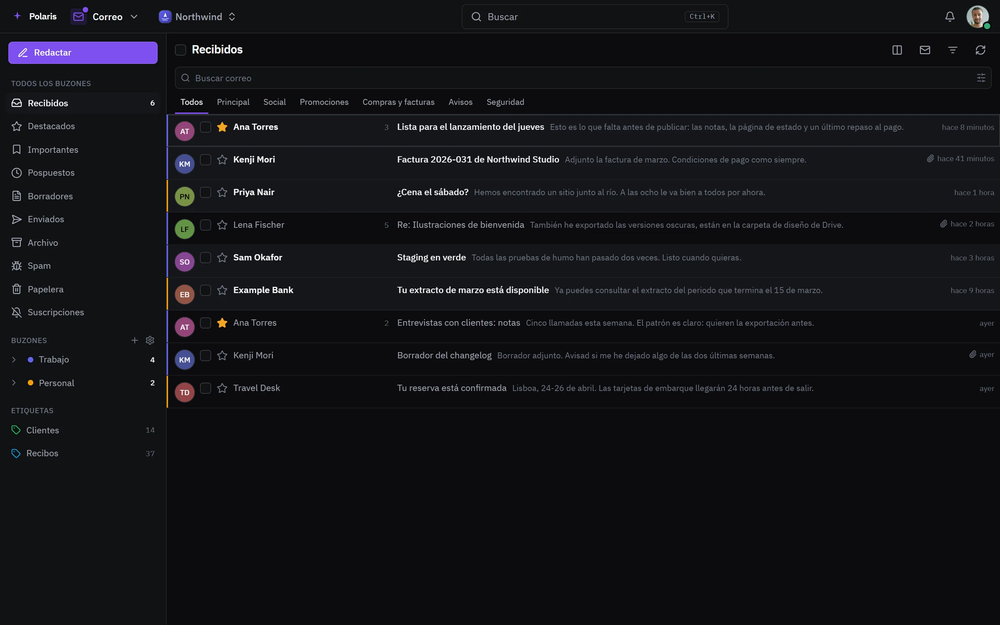
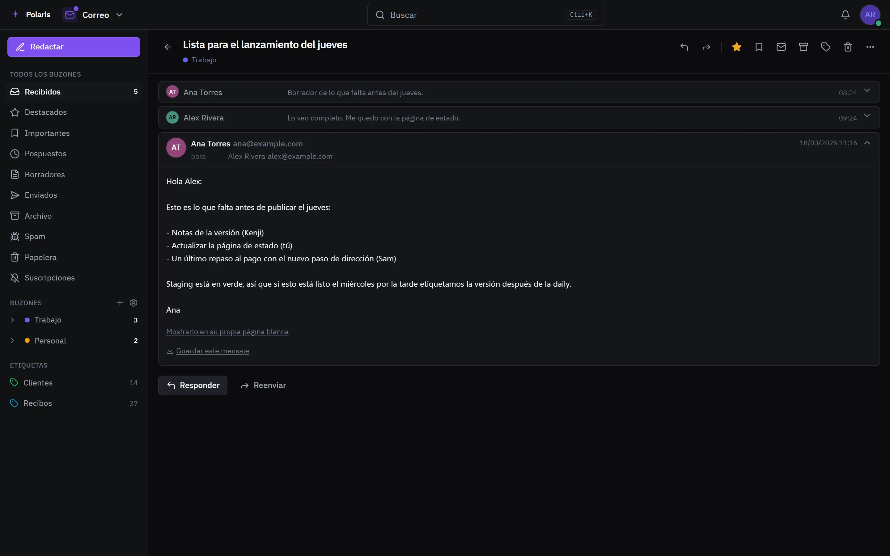

# Correo

[Read in English](mail.md) - [Volver al README](../../README.es.md)

Todos tus buzones - Gmail, Outlook, iCloud, Fastmail, Yahoo, Proton a través
de su Bridge o cualquier cuenta IMAP - en una bandeja, leídos y respondidos
desde Polaris.

Cada imagen es la interfaz real dibujada con personas y datos inventados, y
sigue tu ajuste claro u oscuro. Las versiones para móvil están en
[docs/assets/media](../assets/media).

## Una bandeja

<picture>
  <source media="(prefers-color-scheme: light)" srcset="../assets/media/mail-light-es-desktop.webp">
  
</picture>

Las vistas de entrada, destacados e importantes abarcan todos los buzones, y
las etiquetas, la búsqueda y la paleta de comandos funcionan en todos. Los
atajos de teclado cubren la lista y la conversación.

## Una conversación

<picture>
  <source media="(prefers-color-scheme: light)" srcset="../assets/media/mail-thread-light-es-desktop.webp">
  
</picture>

Una conversación se lee como un hilo. Las imágenes externas se cargan a través
de Polaris, así que el remitente no ve cuándo ni dónde la abriste, y tú decides
cuánto se carga. El spam dice por qué se consideró spam, y un remitente que
publica cómo darse de baja tiene un botón para hacerlo; Suscripciones lista
todos los que han llegado.

## Escribir

Envía ahora o a la hora que elijas, con un momento para recuperar un mensaje
recién enviado. Plantillas, una firma por dirección e identidades de envío se
guardan en los ajustes.

## Ajustes

Buzones, enviar como, etiquetas, filtros, firma, plantillas, privacidad, spam,
remitentes bloqueados, respuesta de ausencia, importar y exportar, y atajos.
