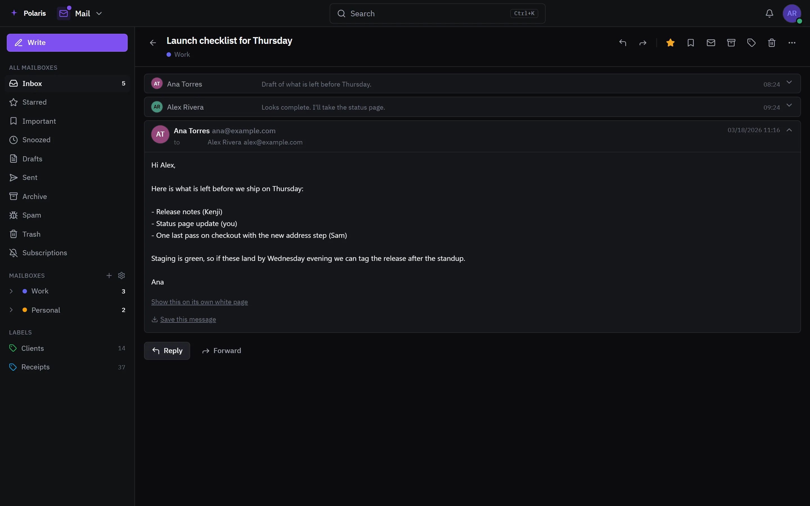

# Mail

[Leer en español](mail.es.md) - [Back to the README](../../README.md)

Every mailbox you have - Gmail, Outlook, iCloud, Fastmail, Yahoo, Proton
through its Bridge, or any IMAP account - in one inbox, read and answered from
Polaris.

Every picture is the real interface drawn with made-up people and data, and
follows your light or dark setting. Phone-sized versions are in
[docs/assets/media](../assets/media).

## One inbox

<picture>
  <source media="(prefers-color-scheme: light)" srcset="../assets/media/mail-light-en-desktop.webp">
  
</picture>

The inbox, starred and important views span every mailbox, and labels, search
and a command palette work across all of them. Keyboard shortcuts cover the
list and the conversation.

## A conversation

<picture>
  <source media="(prefers-color-scheme: light)" srcset="../assets/media/mail-thread-light-en-desktop.webp">
  
</picture>

A conversation reads as a thread. Pictures from outside load through Polaris,
so a sender cannot see when or where you opened it, and how much loads is your
choice. Junk says why it was judged junk, and a sender that publishes a way off
its list gets an unsubscribe button; Subscriptions lists every one seen.

## Writing

Send now or at a time you pick, with a moment to bring a message back after
sending. Templates, a signature per address, and send-as identities are kept
in settings.

## Settings

Mailboxes, send-as, labels, filters, signature, templates, privacy, junk,
blocked senders, an away reply, import and export, and shortcuts.
