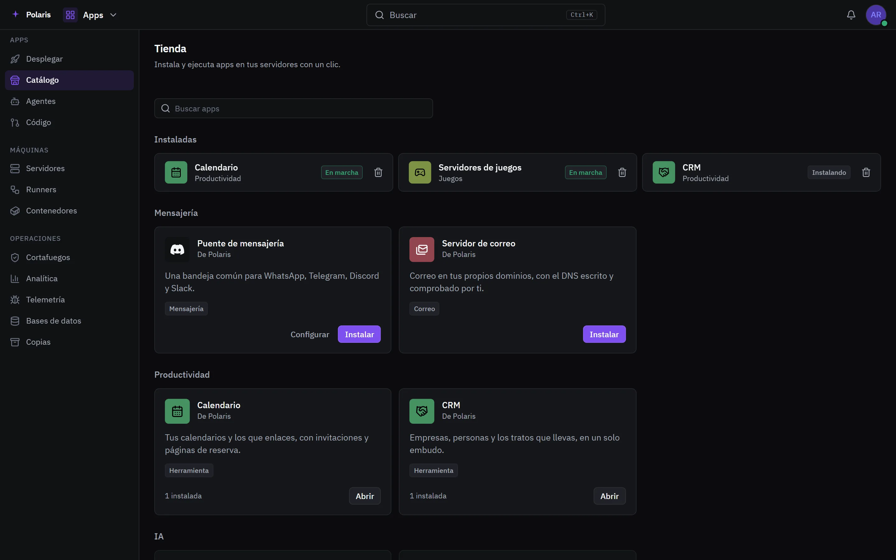
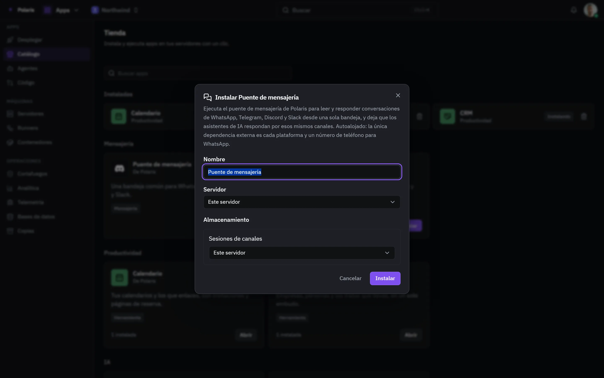

# Marketplace

[Read in English](marketplace.md) - [Volver al README](../../README.es.md)

Las apps que Polaris puede añadir, instaladas con un clic: Calendario, CRM,
Herramientas, un servidor de correo para tus dominios, servidores de juegos,
Places para cámaras y dispositivos, y el puente de mensajería detrás del Inbox.

Cada imagen es la interfaz real dibujada con personas y datos inventados, y
sigue tu ajuste claro u oscuro. Las versiones para móvil están en
[docs/assets/media](../assets/media).

## El catálogo

<picture>
  <source media="(prefers-color-scheme: light)" srcset="../assets/media/marketplace-light-es-desktop.webp">
  
</picture>

Las apps instaladas van arriba con su estado, y el resto del catálogo por
categoría debajo. La mayoría no ejecuta nada al instalarse: activa sus
pantallas y descarga un motor solo cuando alguien lo usa por primera vez - el
servidor de un juego llega la primera vez que se crea un servidor de ese juego.

## Instalar eligiendo

<picture>
  <source media="(prefers-color-scheme: light)" srcset="../assets/media/marketplace-install-light-es-desktop.webp">
  
</picture>

Una app que ejecuta su propio contenedor se instala tal cual o se configura
antes: su nombre, la máquina donde corre y si cada uno de sus volúmenes vive en
esa máquina o en un NAS de Drive.
