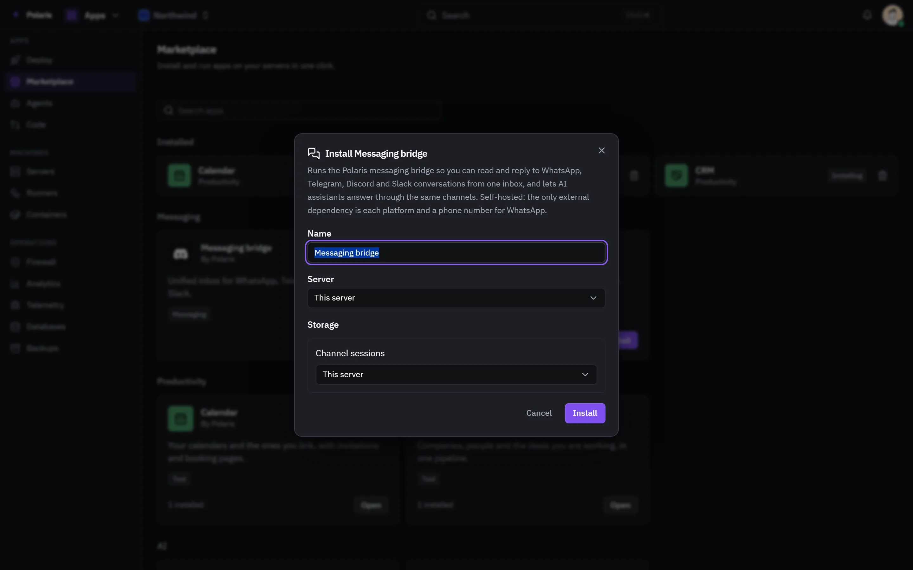

# Marketplace

[Leer en español](marketplace.es.md) - [Back to the README](../../README.md)

The apps Polaris can add, installed with one press: Calendar, CRM, Tools, a
mail server for your own domains, game servers, Places for cameras and smart
devices, and the messaging bridge behind the Inbox.

Every picture is the real interface drawn with made-up people and data, and
follows your light or dark setting. Phone-sized versions are in
[docs/assets/media](../assets/media).

## The catalog

<picture>
  <source media="(prefers-color-scheme: light)" srcset="../assets/media/marketplace-light-en-desktop.webp">
  
</picture>

Installed apps sit at the top with their state, and the rest of the catalog by
category below. Most apps run nothing when installed: they switch their screens
on, and download an engine only when somebody first uses it - a game's server
arrives the first time a server of that game is created.

## Installing with choices

<picture>
  <source media="(prefers-color-scheme: light)" srcset="../assets/media/marketplace-install-light-en-desktop.webp">
  
</picture>

An app that runs a container of its own can be installed as it comes, or
configured first: its name, the machine it runs on, and whether each of its
volumes lives on that machine or on a NAS from Drive.
