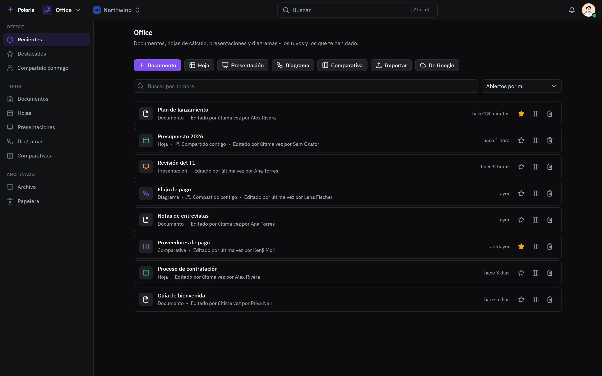
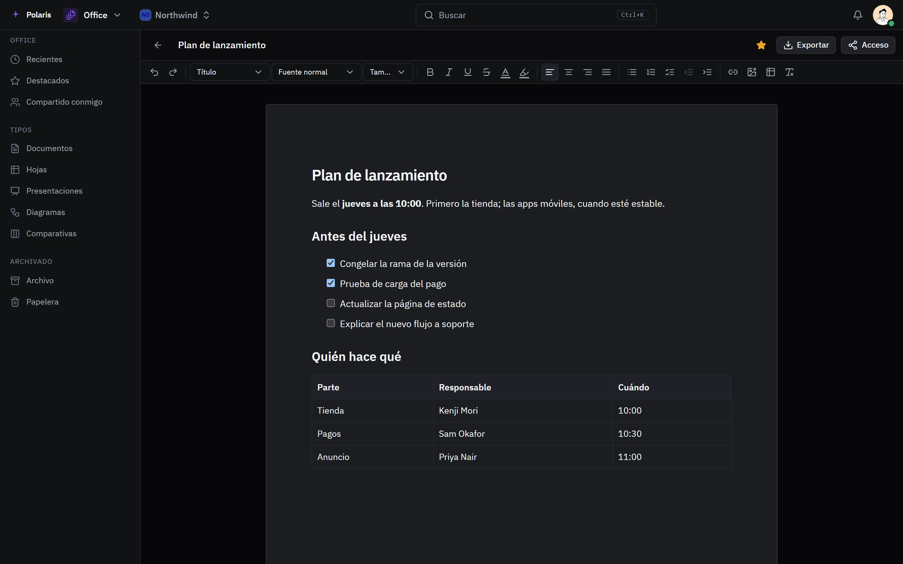

# Office

[Read in English](office.md) - [Volver al README](../../README.es.md)

Documentos, hojas de cálculo, presentaciones, diagramas y comparativas,
guardados en Polaris y editados en equipo.

Cada imagen es la interfaz real dibujada con personas y datos inventados, y
sigue tu ajuste claro u oscuro. Las versiones para móvil están en
[docs/assets/media](../assets/media).

## Tus documentos

<picture>
  <source media="(prefers-color-scheme: light)" srcset="../assets/media/office-light-es-desktop.webp">
  
</picture>

Todo lo que creaste o te pasaron, por tipo, con destacados, compartidos
conmigo, archivo y papelera. Los Google Docs y Sheets se abren aquí como copia,
y el original sigue igual en Google Drive.

## Editar

<picture>
  <source media="(prefers-color-scheme: light)" srcset="../assets/media/office-doc-light-es-desktop.webp">
  
</picture>

Varias personas editan el mismo documento a la vez y ven los cambios de los
demás mientras se escriben. Los documentos admiten títulos, fuentes, colores,
checklists, tablas e imágenes. Las hojas de cálculo tienen fórmulas y formatos
numéricos. Las presentaciones tienen diseños, temas, gráficos, transiciones y
animaciones, notas del orador y vista de presentador.

## Compartir y exportar

Comparte con una persona, un equipo o un rol como lector, comentarista o
editor, o crea un enlace. Exporta, imprime o guarda como PDF desde el editor.
