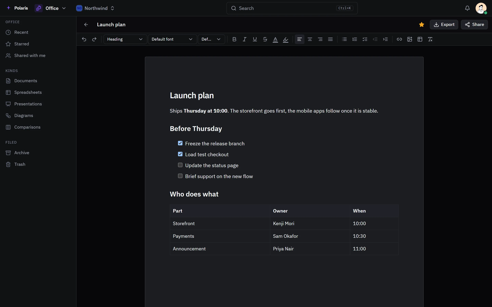

# Office

[Leer en español](office.es.md) - [Back to the README](../../README.md)

Documents, spreadsheets, presentations, diagrams and comparisons, kept in
Polaris and edited together.

Every picture is the real interface drawn with made-up people and data, and
follows your light or dark setting. Phone-sized versions are in
[docs/assets/media](../assets/media).

## Your documents

<picture>
  <source media="(prefers-color-scheme: light)" srcset="../assets/media/office-light-en-desktop.webp">
  
</picture>

Everything you made or were given, by kind, with starred, shared with me,
archive and trash. Google Docs and Sheets open here as a copy, leaving the
original in Google Drive as it was.

## Editing

<picture>
  <source media="(prefers-color-scheme: light)" srcset="../assets/media/office-doc-light-en-desktop.webp">
  
</picture>

Several people edit the same document at once and see each other's changes as
they are typed. Documents take headings, fonts, colors, checklists, tables and
images. Spreadsheets have formulas and number formats. Presentations have
layouts, themes, charts, transitions and animations, speaker notes, and a
presenter view.

## Sharing and export

Share with a person, a team or a role as viewer, commenter or editor, or make a
link. Export, print or save as PDF from the editor.
