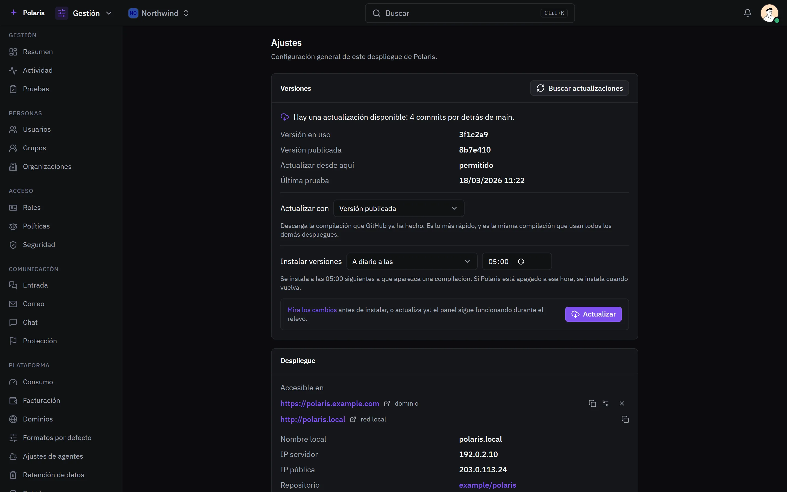
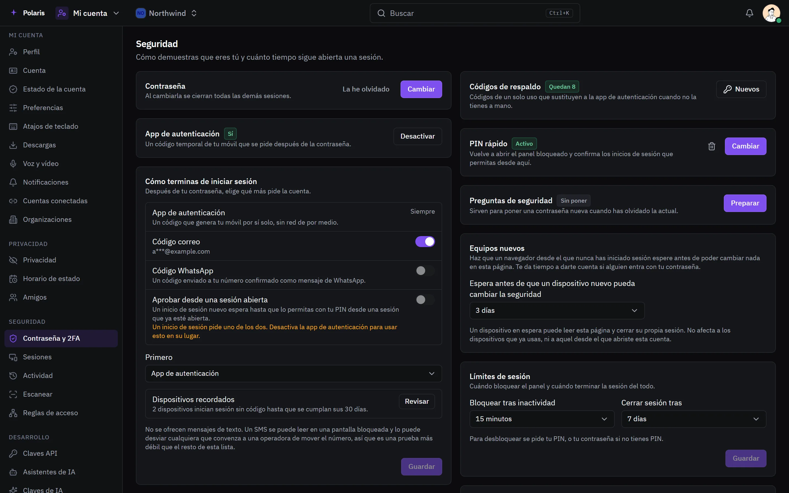

# Ajustes

[Read in English](settings.md) - [Volver al README](../../README.es.md)

Dos tipos de ajustes: los del despliegue, para quien administra Polaris, y los
de la cuenta de cada persona.

Cada imagen es la interfaz real dibujada con personas y datos inventados, y
sigue tu ajuste claro u oscuro. Las versiones para móvil están en
[docs/assets/media](../assets/media).

## El despliegue

<picture>
  <source media="(prefers-color-scheme: light)" srcset="../assets/media/settings-light-es-desktop.webp">
  
</picture>

Las actualizaciones se instalan con el botón Actualizar, en el horario que
elijas o en cuanto se publican - desde la versión publicada o compiladas en
este host. La página muestra dónde se llega a Polaris, sus páginas públicas
para proveedores OAuth, los temas de temporada y una forma de llevarlo todo a
otra máquina en un archivo sellado con frase de paso.

## Tu cuenta

<picture>
  <source media="(prefers-color-scheme: light)" srcset="../assets/media/account-security-light-es-desktop.webp">
  
</picture>

Cómo demuestras que eres tú y cuánto dura una sesión: contraseña, app de
autenticación, códigos por correo o WhatsApp, passkeys, códigos de respaldo, un
PIN de desbloqueo rápido, dispositivos de confianza, inicio de sesión con una
cuenta conectada, bloqueo por inactividad y límites de sesión, y un sucesor
para tus organizaciones. La cuenta también tiene su perfil, privacidad,
notificaciones, sesiones, claves de API y los asistentes de IA que pueden
actuar por ti.

## Todo lo demás también se configura

El chat tiene [reglas para toda la instancia](chat.es.md#reglas-para-toda-la-instancia),
[ajustes por canal](chat.es.md#ajustes-del-canal) y
[tu privacidad](chat.es.md#tu-privacidad); el correo tiene
[sus propios ajustes](mail.es.md#ajustes).
