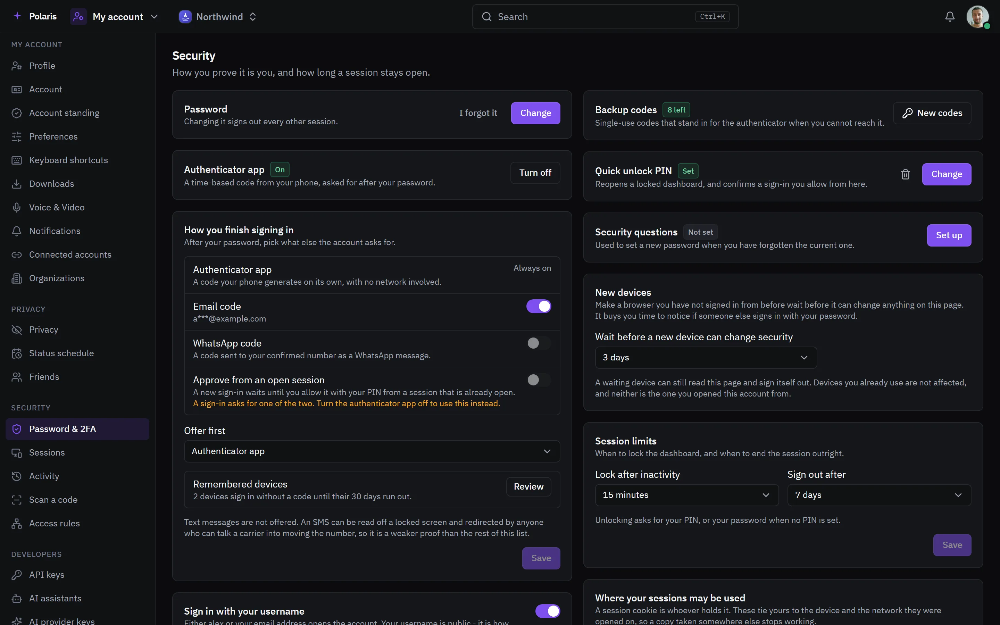

# Settings

[Leer en español](settings.es.md) - [Back to the README](../../README.md)

Two kinds of settings: the deployment's, for whoever runs Polaris, and each
person's own account.

Every picture is the real interface drawn with made-up people and data, and
follows your light or dark setting. Phone-sized versions are in
[docs/assets/media](../assets/media).

## The deployment

<picture>
  <source media="(prefers-color-scheme: light)" srcset="../assets/media/settings-light-en-desktop.webp">
  
</picture>

Updates install from the Update button, on a schedule you pick, or as soon as
one is published - from the published build, or built on this host. The page
shows where Polaris is reachable, its public pages for OAuth providers, the
seasonal themes, and a way to move everything to another machine in one
passphrase-sealed file.

## Your account

<picture>
  <source media="(prefers-color-scheme: light)" srcset="../assets/media/account-security-light-en-desktop.webp">
  
</picture>

How you prove it is you, and how long a session stays open: password,
authenticator app, codes by email or WhatsApp, passkeys, backup codes, a quick
unlock PIN, trusted devices, sign-in with a connected account, idle lock and
session limits, and a successor for your organizations. The account also has
its profile, privacy, notifications, sessions, API keys and the AI assistants
that may act as you.

## Everything else is configurable too

Chat has [rules for the whole instance](chat.md#rules-for-the-whole-instance),
[settings per channel](chat.md#channel-settings) and
[your own privacy](chat.md#your-privacy); Mail has
[its own settings](mail.md#settings).
