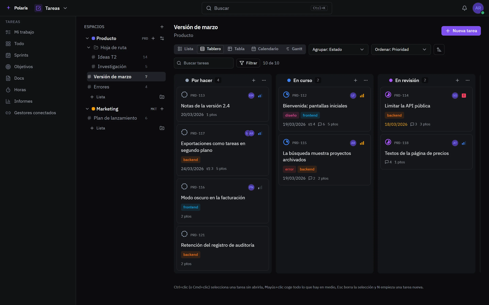
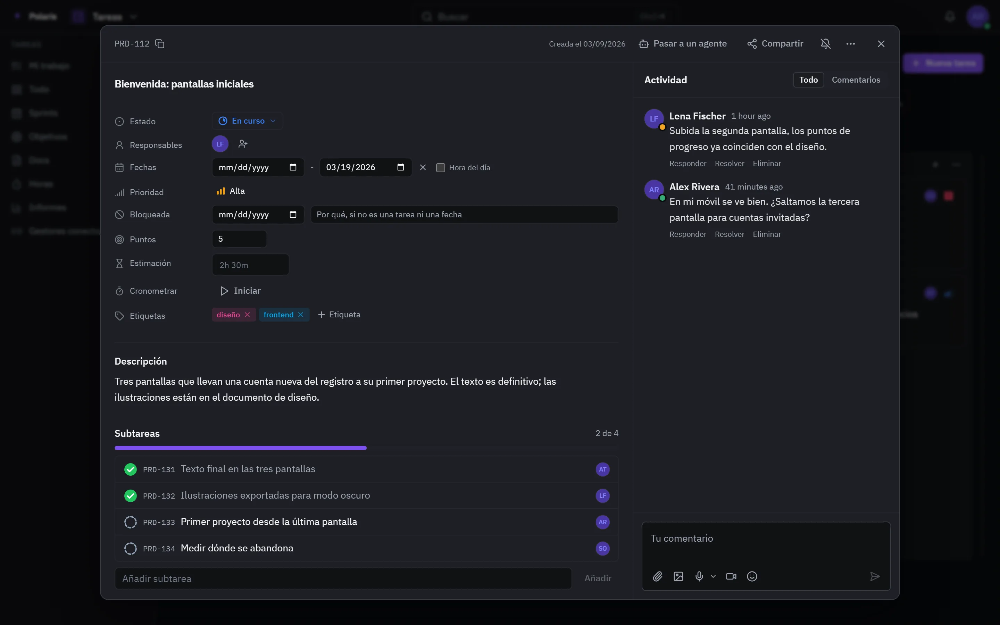

# Tareas

[Read in English](tasks.md) - [Volver al README](../../README.es.md)

Espacios, listas y el trabajo que contienen, para una persona o para toda una
organización. Las tareas se enlazan con el resto de Polaris: una tarea puede
llevar sus archivos, pasarse a un agente de código y aparecer en el calendario
cuando vence.

Cada imagen es la interfaz real dibujada con personas y datos inventados, y
sigue tu ajuste claro u oscuro. Las versiones para móvil están en
[docs/assets/media](../assets/media).

## Tableros y vistas

<picture>
  <source media="(prefers-color-scheme: light)" srcset="../assets/media/tasks-light-es-desktop.webp">
  
</picture>

Un espacio agrupa listas, y cada lista se abre como lista, tabla, tablero,
calendario o diagrama de Gantt. Agrupa y ordena por cualquier campo, filtra,
busca y edita muchas tareas a la vez desde la barra de selección. Lo
seleccionado se exporta como CSV.

## Una tarea, abierta

<picture>
  <source media="(prefers-color-scheme: light)" srcset="../assets/media/task-panel-light-es-desktop.webp">
  
</picture>

Una tarea se abre junto a la lista en lugar de sustituirla. Guarda su estado,
responsables, prioridad, fechas, etiquetas y campos personalizados, subtareas y
checklists, archivos, una conversación con menciones, los commits que la
nombran y el tiempo registrado. Desde el mismo panel se comparte o se pasa a un
agente de código, que trabaja en su propia rama y comenta dónde está el trabajo.

## Planificación

- **Sprints**: tandas de trabajo con fecha, con lo que queda cada día.
- **Objetivos**: medidos con metas; una meta que sigue una lista se actualiza
  sola.
- **Docs**: páginas escritas junto al trabajo que describen.
- **Informes** y una **hoja de horas** de la semana, con el tiempo facturable
  aparte.

## Menos a mano

- **Automatizaciones**: cuando pasa algo en una lista, haz algo - moverla,
  asignarla, comentar, añadir una subtarea.
- **Formularios de entrada**: una página pública que archiva lo que recoge como
  tarea.
- **Trackers**: issues de Linear y Jira reflejadas en una lista, con el estado
  devuelto. Google Tasks se sincroniza en los dos sentidos.
