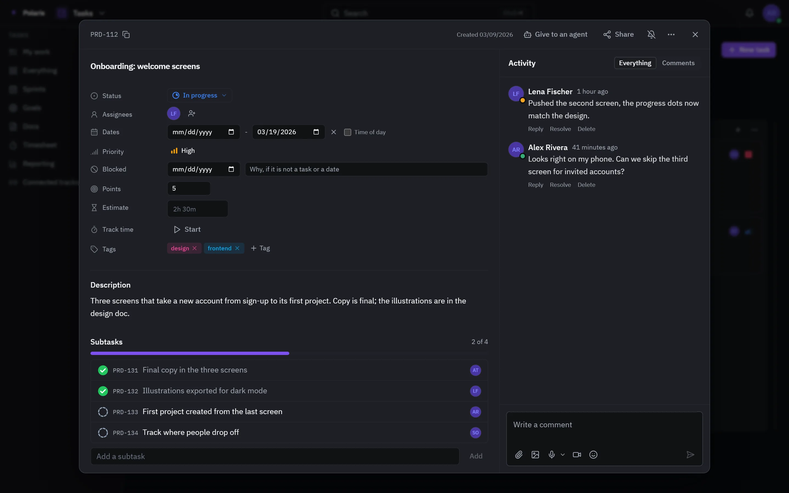

# Tasks

[Leer en español](tasks.es.md) - [Back to the README](../../README.md)

Spaces, lists and the work in them, for one person or a whole organization.
Tasks link to the rest of Polaris: a task can carry its files, be handed to a
coding agent, and show up on the calendar when it is due.

Every picture is the real interface drawn with made-up people and data, and
follows your light or dark setting. Phone-sized versions are in
[docs/assets/media](../assets/media).

## Boards and views

<picture>
  <source media="(prefers-color-scheme: light)" srcset="../assets/media/tasks-light-en-desktop.webp">
  
</picture>

A space holds lists, and every list opens as a list, a table, a board, a
calendar or a Gantt chart. Group and sort by any field, filter, search, and
edit many tasks at once from the selection bar. What is selected exports as a
CSV file.

## A task, open

<picture>
  <source media="(prefers-color-scheme: light)" srcset="../assets/media/task-panel-light-en-desktop.webp">
  
</picture>

A task opens beside the list instead of replacing it. It keeps its status,
assignees, priority, dates, tags and custom fields, subtasks and checklists,
files, a conversation with mentions, the commits that mention it, and the time
logged on it. From the same panel it can be shared, or handed to a coding agent
that works on a branch of its own and comments back where the work is.

## Planning

- **Sprints**: time-boxed runs of work, with what is left each day.
- **Goals**: objectives measured by targets; a target that watches a list keeps
  itself current.
- **Docs**: pages written next to the work they describe.
- **Reporting** and a **timesheet** of the week, with billable time apart.

## Less by hand

- **Automations**: when something happens in a list, do something - move it,
  assign it, comment, add a subtask.
- **Intake forms**: a public page that files what it collects as a task.
- **Trackers**: issues from Linear and Jira mirrored into a list, with the
  status pushed back. Google Tasks syncs both ways.
