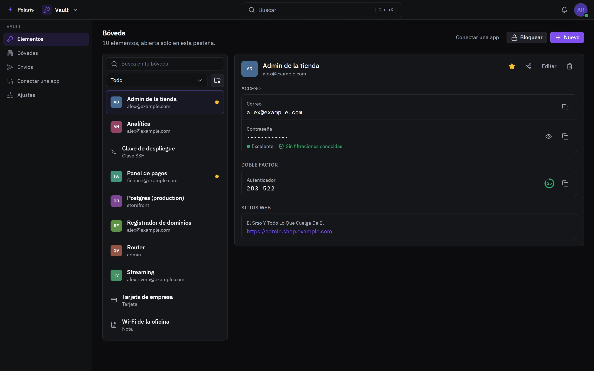
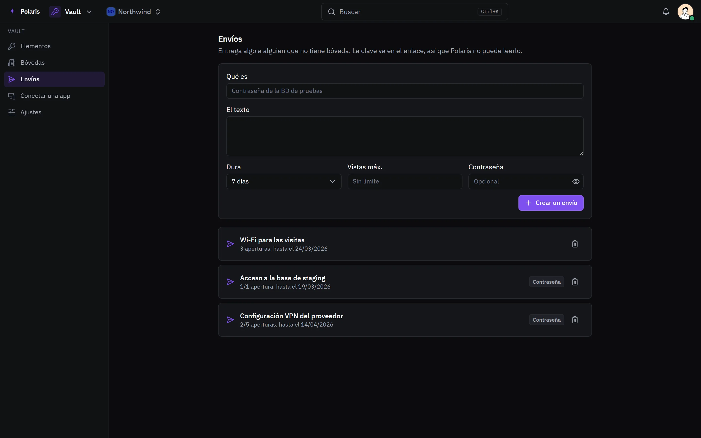

# Bóveda

[Read in English](vault.md) - [Volver al README](../../README.es.md)

Un gestor de contraseñas que habla el protocolo de Bitwarden, así que las apps
y extensiones de Bitwarden apuntan a tu propio Polaris. Todo se cifra en el
navegador; el servidor nunca ve la contraseña maestra ni lo que guardas.

Cada imagen es la interfaz real dibujada con personas y datos inventados, y
sigue tu ajuste claro u oscuro. Las versiones para móvil están en
[docs/assets/media](../assets/media).

## Elementos

<picture>
  <source media="(prefers-color-scheme: light)" srcset="../assets/media/vault-light-es-desktop.webp">
  
</picture>

Accesos con códigos de un solo uso, tarjetas, identidades, notas seguras y
claves SSH, en carpetas y con favoritos. Un código de un solo uso se añade
escaneando su QR. Una contraseña que aparece en una filtración conocida se
marca, comprobada sin que la contraseña salga del navegador.

## Envíos

<picture>
  <source media="(prefers-color-scheme: light)" srcset="../assets/media/vault-sends-light-es-desktop.webp">
  
</picture>

Un envío entrega algo a alguien que no tiene bóveda. La clave va en el enlace,
así que Polaris no puede leerlo; admite contraseña, límite de vistas y
caducidad. Los envíos creados en las apps de Bitwarden también aparecen aquí.

## Bóvedas compartidas

Las bóvedas compartidas con una organización guardan lo que un equipo usa en
común, cada una con sus miembros. Importa desde Bitwarden, KeePass o cualquier
CSV, y exporta desde los ajustes de la bóveda.
