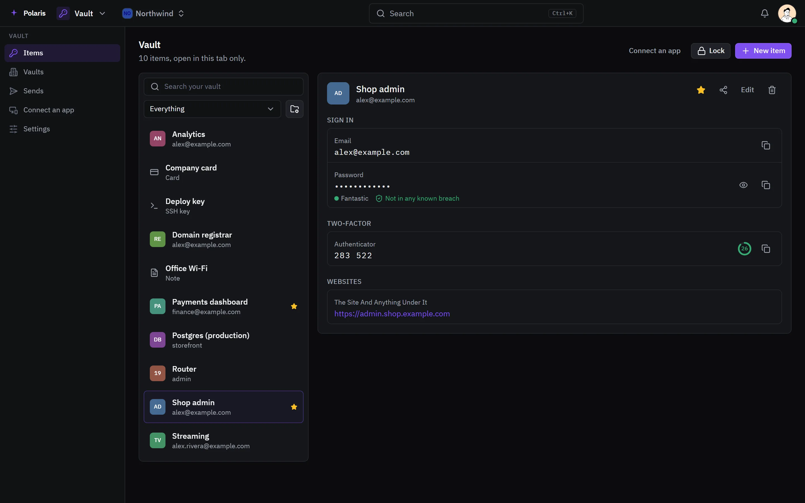
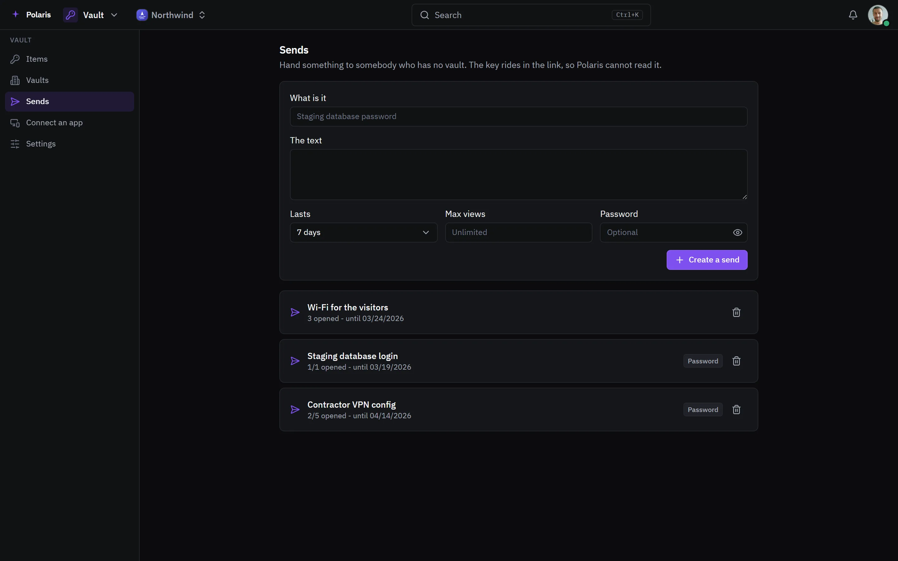

# Vault

[Leer en español](vault.es.md) - [Back to the README](../../README.md)

A password manager that speaks the Bitwarden protocol, so the Bitwarden apps
and browser extensions point at your own Polaris. Everything is encrypted in
the browser; the server never sees the master password or what is stored.

Every picture is the real interface drawn with made-up people and data, and
follows your light or dark setting. Phone-sized versions are in
[docs/assets/media](../assets/media).

## Items

<picture>
  <source media="(prefers-color-scheme: light)" srcset="../assets/media/vault-light-en-desktop.webp">
  
</picture>

Logins with one-time codes, cards, identities, secure notes and SSH keys, in
folders, with favorites. A one-time code can be added by scanning its QR code.
A password found in a known breach is flagged, checked without the password
ever leaving the browser.

## Sends

<picture>
  <source media="(prefers-color-scheme: light)" srcset="../assets/media/vault-sends-light-en-desktop.webp">
  
</picture>

A Send hands something to somebody who has no vault. The key travels in the
link, so Polaris cannot read it; it can carry a password, a view limit and an
expiry. Sends made in the Bitwarden apps show up here too.

## Shared vaults

Vaults shared with an organization hold what a team uses together, each with
its own members. Import from Bitwarden, KeePass or any CSV, and export from
the vault settings.
